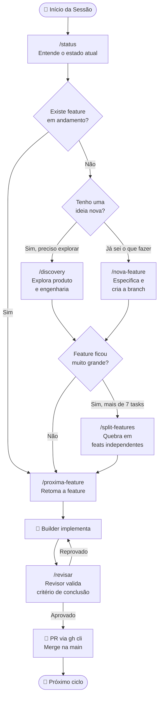
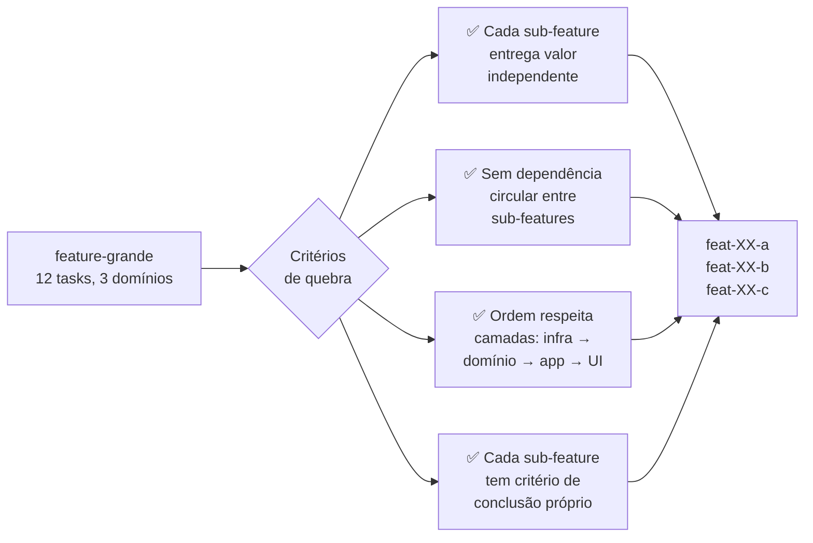
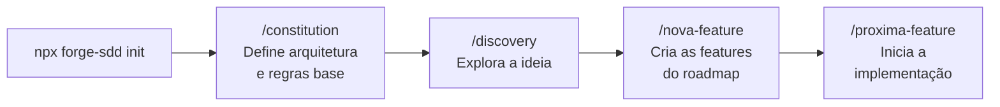
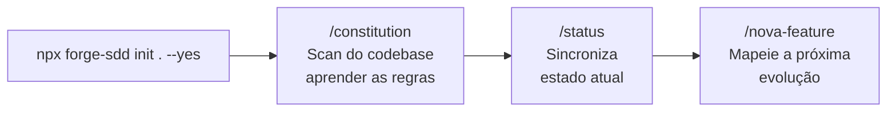

# forge-sdd

[](https://www.npmjs.com/package/@nathanramorim/forge-sdd)
[](https://opensource.org/licenses/MIT)

> CLI open source que instala em qualquer projeto a **Metodologia Forge-SDD** — um framework de desenvolvimento guiado por IA que elimina a repetição de instruções, garante padrões arquiteturais e traz a expertise de um engenheiro sênior para o seu fluxo diário.

🚀 **Landing Page:** [forge-sdd.vercel.app](https://forge-sdd.vercel.app)

## Por que o forge-sdd? (Open Source)

O **forge-sdd** nasceu para **mudar a dinâmica de desenvolvimento orientado a IA**. Como um projeto **Open Source** (licenciado sob a licença MIT), ele resolve o desafio de manter a consistência e velocidade do desenvolvimento através de 4 pilares fundamentais:

| Pilar | O que resolve |
|-------|--------------|
| 🤖 **Controle de Fluxo com IA** | A IA atua de forma guiada e previsível (Orquestrador → Builder → Revisor) |
| 🧠 **Sem Repetição de Instruções** | As regras do projeto ficam em arquivos locais e a IA as lê a cada sessão |
| 🔄 **Padrões & Incrementalidade** | Cada evolução segue os padrões da sua arquitetura, de forma acumulativa |
| 🎓 **Expertise Sênior Embutida** | Discovery estruturado, specs claras e revisão automatizada de código |

O forge-sdd foi aberto para que a comunidade possa evoluir e adaptar o fluxo de scaffolding de SDDs para qualquer stack de desenvolvimento de forma livre.

---

## Instalação & Inicialização

Durante a inicialização, você deve definir para quais agentes de IA deseja gerar a estrutura do SDD (Copilot, Gemini ou Claude):

```bash
# Inicialização interativa (permite escolher os agentes no menu)
npx @nathanramorim/forge-sdd@latest init

# Inicialização direta no diretório atual especificando os agentes
npx @nathanramorim/forge-sdd@latest init . --agent copilot,gemini,claude --name meu-projeto
```

---

## O que é gerado após o `init`

```
sdd/                          → memória e especificação do projeto
  memory/
    progress.md               → estado ativo (leia primeiro a cada sessão)
    constitution.md           → regras imutáveis do projeto
  spec/
    overview.md, stack.md, modules.md, flows.md, decisions.md
  features/
    feat-00-foundation.md     → feature inicial
    index.md                  → mapa de features

# Agente Selecionado (Ex: Gemini)
.gemini/
  skills/*.chatmode.md        → 6 papéis: Orquestrador, Builder, Revisor…
  prompts/*.prompt.md         → comandos: /status, /nova-feature…
GEMINI.md                     → Instruções de contexto para o Gemini

.vscode/
  mcp.json                    → configuração dos MCPs (context7, git)
```

---

## 🗺️ Fluxo de Desenvolvimento

O Forge-SDD organiza o trabalho em ciclos curtos e incrementais. O diagrama abaixo mostra o fluxo completo:



---

## 📖 Guia: Quando usar cada comando?

### `/discovery` — Explore antes de especificar

Use quando você tem **uma ideia mas ainda não sabe exatamente o que construir**. O agente assume as personas de PM e Engenheiro Sênior e conduz uma sessão estruturada para definir o "o quê", o "para quem" e o "como".

```
Quando usar: Ideia vaga → /discovery → Features bem definidas
Quando NÃO usar: Se você já sabe exatamente o que fazer, vá direto para /nova-feature
```

### `/nova-feature` — Registre e inicie

Use quando você já sabe o que implementar. O agente:
1. Cria a branch `feat/<nome>` imediatamente
2. Cria o arquivo `sdd/features/feat-XX-<nome>.md` com objetivo, tasks e critério de conclusão
3. Atualiza o índice de features

```
Regra de ouro: a branch é criada ANTES do arquivo de spec
```

### `/split-features` — Quebre features grandes

Use quando uma feature ficou **grande demais** (mais de 7 tasks ou abrange mais de um domínio). O agente aplica os critérios de desacoplamento:



### `/proxima-feature` — Implemente

Usa quando quer iniciar ou retomar a próxima feature do backlog. O Orquestrador lê o `progress.md`, identifica a feature `todo` mais prioritária, cria a branch e delega ao Builder.

### `/revisar` — Valide antes do merge

Sempre rode antes de criar o PR. O Revisor valida:
- ✅ O critério de conclusão definido na spec foi atingido?
- ✅ `go vet` / lint passou?
- ✅ Arquivos de memória (`progress.md`) estão atualizados?

    B --> C["✅ Cada sub-feature\nentrega valor\nindependente"]
    B --> D["✅ Sem dependência\ncircular entre\nsub-features"]
    B --> E["✅ Ordem respeita\ncamadas: infra →\ndomínio → app → UI"]
    B --> F["✅ Cada sub-feature\ntem critério de\nconclusão próprio"]

## 🚀 Trilhas de Início Rápido

### 🆕 Projeto do Zero

Ao iniciar um projeto do zero, você pode escolher quais agentes deseja configurar (Copilot, Gemini ou Claude). Use a flag `--agent` no `init` para configurar múltiplos agentes simultaneamente.



1. `npx @nathanramorim/forge-sdd@latest init` (especifique os agentes desejados como Copilot, Gemini ou Claude)
2. `/constitution` → define arquitetura e regras base
3. `/discovery "sua ideia"` → explora produto e engenharia
4. `/nova-feature` → cria features do roadmap
5. `/proxima-feature` → inicia a implementação

### 🏗️ Projeto Existente (Adoção)

Para adotar a metodologia em um projeto existente sem alterar sua estrutura atual, inicialize diretamente no diretório corrente (`.`) e informe para quais agentes deseja gerar os arquivos (ex: `copilot`, `gemini`, `claude`):



1. `npx @nathanramorim/forge-sdd@latest init . --yes` (especifique os agentes desejados via flags, ex: `--agent copilot,gemini`)
2. `/constitution` → o agente escaneia seu codebase e aprende as regras do seu projeto
3. `/status` → sincroniza o estado atual do progresso
4. `/nova-feature` → mapeia a próxima evolução

---

## 🛠️ Referência de Comandos

| Comando | Quando usar | O que faz |
|---------|-------------|-----------|
| `/status` | Início de sessão | Lê `progress.md` e reporta fases e bloqueios |
| `/discovery <ideia>` | Ideia vaga | Sessão de discovery com personas PM + Engenheiro Sênior |
| `/nova-feature <desc>` | Ideia clara | Cria branch + spec + atualiza índice |
| `/split-features` | Feature grande (>7 tasks) | Quebra em sub-features desacopladas |
| `/proxima-feature` | Iniciar implementação | Retoma a próxima feature `todo` |
| `/revisar` | Antes do PR | Valida critério de conclusão e qualidade |
| `/constitution` | Início ou mudança arch. | Alinha `constitution.md` com o codebase real |
| `/c4-architecture` | Documentar arquitetura | Gera diagramas C4 em Mermaid |
| `/doctor` | Diagnóstico | Verifica integridade, MCPs e budgets |
| `/archive` | `progress.md` > 1 KB | Move histórico antigo para o log |
| `/upgrade-sdd` | Nova versão SDD | Migra a estrutura para a versão mais recente |
| `/install-skill` | Reutilizar skill | Importa skill de uma URL do GitHub |

---

## 🤖 Agentes Suportados

| Agente | Flag | Como acionar os comandos |
|--------|------|--------------------------|
| **GitHub Copilot** | `copilot` | Use `/` no chat do VS Code (ex: `/status`) |
| **Claude** | `claude` | Mencione o comando no chat (ex: `/revisar`) |
| **Gemini** | `gemini` | Peça pelo nome ("rodar o status") |

```bash
# Um agente
forge-sdd init --yes --agent gemini --name meu-projeto

# Múltiplos agentes
forge-sdd init --yes --agent copilot,claude,gemini --name meu-projeto
```

---

## Contribuição

Veja [CONTRIBUTING.md](CONTRIBUTING.md) para detalhes sobre como contribuir.

## Licença

Distribuído sob a licença MIT. Veja `LICENSE` para mais informações.
