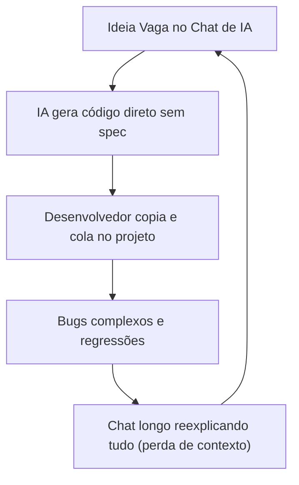
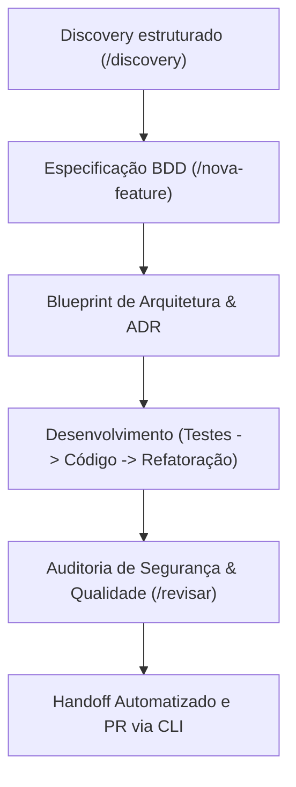
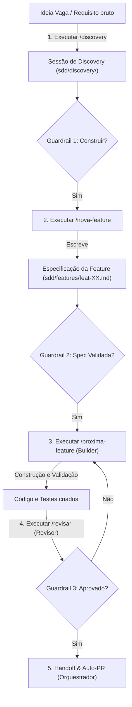
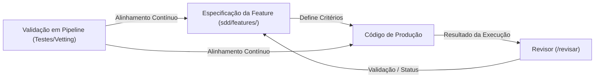
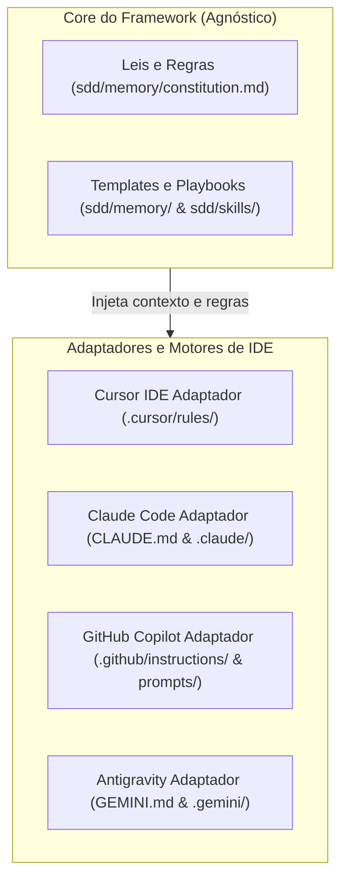

# Arquitetura, Fluxo e Metodologia Estruturada do Forge-SDD

O **Forge-SDD** é um framework operacional para times de desenvolvimento e de produto focado no ciclo contínuo de **Discovery → Spec → Test → Code**. Ele organiza a interação com Inteligências Artificiais e agentes autônomos por meio de fases bem definidas com artefatos persistidos no próprio repositório, mitigando a perda de contexto inerente a chats convencionais de LLM.

---

## 1. Domínios Estruturais (Mapeamento de Pastas e Arquivos)

O ecossistema do Forge-SDD organiza o repositório em domínios específicos para garantir a separação entre descobertas de negócio, especificações técnicas, regras de arquitetura e código de produção.

```
/
├── .github/ ou .gemini/ ou .claude/  # Domínio de Instruções e Prompts dos Agentes
│   ├── chatmodes/                  # (Copilot/Gemini) Definições de papéis de agentes (Orquestrador, etc.)
│   ├── prompts/                    # (Copilot/Gemini) Gatilhos estruturados de prompt (/status, etc.)
│   └── commands/                   # (Claude Code em .claude/) Prompts específicos do Claude Code
│
├── CLAUDE.md ou GEMINI.md           # Instruções de bootstrapping (para Claude ou Gemini na raiz)
│
├── .vscode/                        # Integração com VS Code (opcional se Copilot)
│   └── mcp.json                    # Declaração local de servidores MCP
│
├── docs/                           # Domínio de Documentação Pública e Guias
│   ├── introducao.md               # Onboarding de novos membros do time
│   ├── comandos.md                 # Referência rápida de terminal e chat
│   └── arquitetura-e-fluxo-forge-sdd.md # Este documento de arquitetura e conceitos
│
└── sdd/                            # Domínio do Core do Framework (SDD)
    ├── .sdd-version                # Rastreamento de versão do framework
    ├── .sddrc                      # Configurações locais (Ex: habilitar telemetria)
    ├── README.md                   # Resumo rápido do SDD local
    ├── HOWTO.md                    # Instruções de operação para a IA
    │
    ├── memory/                     # Memória Persistente do Projeto
    │   ├── constitution.md         # A "lei universal" do projeto (Stack e Regras)
    │   ├── progress.md             # Estado ativo do projeto (Curto, máx 1 KB)
    │   ├── progress-log.md         # Histórico arquivado das sessões antigas
    │   └── mcps.md                 # Configurações de Model Context Protocol ativas
    │
    ├── spec/                       # Especificações e Arquitetura de Alto Nível
    │   ├── overview.md             # Visão geral de negócio e glossário
    │   ├── stack.md                # Tecnologias, linguagens e bibliotecas oficiais
    │   ├── modules.md              # Mapeamento de módulos e fronteiras de contexto
    │   ├── flows.md                # Fluxos críticos do sistema
    │   └── decisions.md            # Índice central de Architecture Decision Records (ADRs)
    │
    ├── features/                   # Backlog de Desenvolvimento por Feature
    │   ├── index.md                # Índice e grafo de dependência de features
    │   └── feat-XX-*.md            # Especificações individuais de funcionalidade
    │
    └── skills/                     # Habilidades e Guias Técnicos Específicos
        ├── index.md                # Índice e critérios de carregamento das skills
        └── *.md                    # Regras técnicas profundas (Ex: stripe-integration.md)
```

---

## 2. Divisão de Papéis e Responsabilidades

O ciclo de vida do Forge-SDD é gerenciado por agentes virtuais que assumem papéis complementares ao longo da sessão. Cada agente possui um escopo restrito de leitura e escrita para evitar conflitos de merge e desvios de escopo.

| Papel | Responsabilidade Principal | Ações Frequentes | Arquivos Sob sua Escrita |
|---|---|---|---|
| **Orquestrador** | Lê o estado do projeto, planeja a próxima ação, delega tarefas aos demais agentes, grava métricas e encerra a sessão. | `/status`, `/doctor`, `/archive` | `sdd/memory/progress.md`, `.metrics/session-*.json` |
| **Specifier** | Conduz debates de produto e engenharia (discovery), gera especificações estruturadas e detalha tarefas técnicas. | `/discovery`, `/nova-feature`, `/split-features` | `sdd/features/feat-XX-*.md`, `sdd/features/index.md`, `sdd/discovery/*` |
| **Builder** | Codifica a solução com base nas especificações técnicas fornecidas. Aplica o ciclo TDD de forma estrita. | `/proxima-feature` | Código de produção, testes unitários, `sdd/features/feat-XX-*.md` (tasks) |
| **Revisor** | Executa validações automatizadas e auditorias de conformidade com a constituição, regras OWASP e qualidade de código. | `/revisar` | `sdd/features/feat-XX-*.md` (status final) |
| **Archivist** | Mantém a leveza do arquivo de progresso ativo, compactando o histórico da sessão e movendo dados antigos. | `/archive` | `sdd/memory/progress.md`, `sdd/memory/progress-log.md` |
| **Migrator** | Conduz a atualização de versão e layout da estrutura do framework no projeto sem afetar os dados de domínio. | `/upgrade-sdd` | `.sdd-version`, prompts e templates estruturais do framework |

---

## 3. Fluxo de Etapas (Pipeline Operacional)

Uma nova funcionalidade passa por um pipeline operacional sequencial com **Guardrails de Qualidade e Checkpoints**, garantindo que o código só comece a ser escrito após as especificações estarem estruturadas e validadas pelo time.

```
[Problema ou Ideia]
       │
       ▼
1. Execução do comando `/discovery`
       │
       ▼
2. Análise e documentação (discovery/*.md)
       │
       ├─► SE "Descartar / Diferir" ──► Fim do Processo
       │
       └─► SE "Construir" ──► [Guardrail 1: Viabilidade do Produto]
                                   │
                                   ▼
                      3. Execução de `/nova-feature`
                                   │
                                   ▼
                      Geração de Especificação da Feature (feat-XX-*.md)
                                   │
                                   ▼
                             [Guardrail 2: Validação da Spec]
                                   │
                                   ▼
                      4. Ciclo de Implementação (Comando `/proxima-feature`)
                           ├── Test-First (Escrever cenário de teste/asserções)
                           ├── KISS (Escrever código objetivo para passar no teste)
                           └── Refatorar (Otimizar mantendo o teste íntegro)
                                   │
                                   ▼
                      5. Auditoria de Código (Comando `/revisar`)
                           ├── Validação das especificações
                           └── Verificação contra as regras da constituição (linter/go vet)
                                   │
                                   ▼
                      6. Fechamento da Sessão (Orquestrador)
                           ├── Commit e PR Automático
                           ├── Escrita de Telemetria
                           └── Execução de `/archive` se progress.md > 1 KB
```

---

## 4. Diagramas Conceituais e Técnicos

Os diagramas abaixo ilustram o comportamento, ciclo de vida e a arquitetura operacional do framework.

### Diagrama 1: Modo Tradicional (Vibe Coding)
Demonstra a ausência de especificação e controle de contexto no desenvolvimento convencional assistido por IA.



### Diagrama 2: Forge-SDD (Fluxo Estruturado)
Demonstra o fluxo sequencial com preservação de contexto, especificações claras e handoff controlado pelo framework.



### Diagrama 3: Feature Pipeline — Discovery First
Mapeia a ordem cronológica de ações e a transição de responsabilidade desde a ideia até o código verificado.



### Diagrama 4: Closed Loop (Laço Fechado)
Garante que a especificação em markdown e o código-fonte de produção nunca divirjam. Qualquer desvio no código é detectado e a especificação é mantida como a única fonte da verdade.



### Diagrama 5: Arquitetura do Framework e Suporte Multi-IDE
Mostra como o Forge-SDD mantém a independência de IDE por meio de adaptadores específicos que consomem as regras centrais estruturadas em `sdd/`.



---

## 5. Console de Comandos e CLI

O framework disponibiliza comandos divididos em duas categorias: Comandos de Chat (Slash Commands executados pelos agentes dentro do chat da IDE) e Comandos de Terminal (CLI executada localmente).

### Comandos de Chat (IDE / Agente)

* **`/status`**: Analisa e resume o progresso ativo de `sdd/memory/progress.md`. Sempre encerra sugerindo o próximo comando a ser executado, calculado a partir do estado real do projeto.
* **`/tutorial`**: Guia um ciclo SDD completo e fictício (discovery → features → PLAN/ACT/CLOSE), isolado em `sdd/discovery/_tutorial/` e `sdd/features/_tutorial/`, para quem está aprendendo a metodologia.
* **`/discovery <ideia>`**: Abre debate de design de produto e gera o escopo inicial e critérios técnicos em `sdd/discovery/` (`discovery-XX-*.md` e `criteria-XX-*.md`).
* **`/nova-feature <nome>`**: Cria branch do git e gera scaffold inicial da funcionalidade em `sdd/features/feat-XX.md`.
* **`/split-features`**: Quebra especificações que ficaram grandes ou complexas em pequenas tarefas independentes.
* **`/proxima-feature`**: Coloca o Builder para atuar na próxima feature da fila (`status: todo`), configurando a branch local.
* **`/revisar`**: Roda os testes, executa `go vet`/linter e valida o código contra as regras imutáveis da constituição.
* **`/constitution`**: Executa escaneamento da base de código para garantir o alinhamento de tecnologias listadas na constituição. Também pergunta, opcionalmente, o nível de linguagem desejado (`padrão` ou `iniciante`).
* **`/c4-architecture`**: Atualiza ou desenha diagramas Mermaid de alto nível de Contexto e Container (C4 Model).
* **`/doctor`**: Health check da integridade dos arquivos e diretórios da estrutura local, incluindo detecção de deriva de convenção de nomenclatura (`feat-NN` sequencial vs. `feat-xxxx` por hash).
* **`/archive`**: Compacta e arquiva sessões finalizadas de `progress.md` em `progress-log.md` (limite de 1 KB).
* **`/upgrade-sdd <versao>`**: Aciona o Migrator para alinhar a estrutura física local para a versão do framework desejada.

### CLI Local (`forge-sdd`)

* **`forge-sdd init`**: Cria a estrutura de diretórios e templates do zero.
    * `--yes`: Não-interativo (usa valores default).
    * `--dry-run`: Exibe a árvore de arquivos sem de fato alterá-los.
    * `--stack`, `--db`, `--agent`, `--lang`: Flags para customização da inicialização do repositório.
    * `--tutorial`: Sugere rodar `/tutorial` ao final do scaffold.
* **`forge-sdd update`**: Atualiza regras estruturais de agentes, preservando estritamente os diretórios de domínio do projeto (`sdd/`).
* **`forge-sdd doctor`**: Realiza diagnóstico de saúde e integridade da estrutura física do framework no repositório, incluindo deriva de convenção de nomenclatura.
* **`forge-sdd autopilot`**: Ativa o modo autopilot (`sdd/.sdd-auto-pilot`) somente após um número mínimo de ciclos completos registrados em telemetria (`--min-cycles`, default 3), com bypass consciente via `--skip-graduation`.
* **`forge-sdd destroy`**: Desinstala e remove completamente toda a metodologia e configurações de agentes locais (com suporte a `--dry-run` e `--yes`).
* **`forge-sdd version`**: Exibe a versão instalada da CLI do framework.

---

## 6. Mecanismos de Automação (Hooks e Portabilidade)

Para garantir que as regras da constituição e os guardrails de qualidade não sejam ignorados, o framework emprega mecanismos de automação:

1. **Bootstrap de Contexto (IDE Hooks)**: Ao iniciar qualquer interação, as ferramentas de IDE compatíveis leem a memória e o glossário em `sdd/memory/` para injetar terminologias do projeto nas mensagens de sistema do agente.
2. **Process Guard (Lifecycle Guardrails)**: Regras imutáveis de pré-condições embutidas nas mensagens de sistema dos agentes que os impedem de iniciar novas tarefas se houver especificações pendentes de revisão ou testes locais quebrados no repositório.
3. **Session & Metrics Tracker (Telemetria)**: Coleta local de dados anônimos de uso do CLI e registro de métricas de produtividade das sessões de desenvolvimento (como tempos decorridos e contagem de modificações) salvos localmente em `sdd/.metrics/`.
4. **Portabilidade (Fallbacks)**: Em ambientes sem suporte nativo a hooks de lifecycle (como Copilot ou Cursor), as regras de verificação de pré-condições são embutidas nos prompts do kit de instruções do agente, induzindo a verificação manual por parte da IA.
