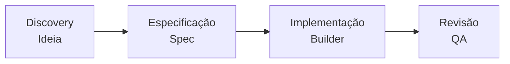
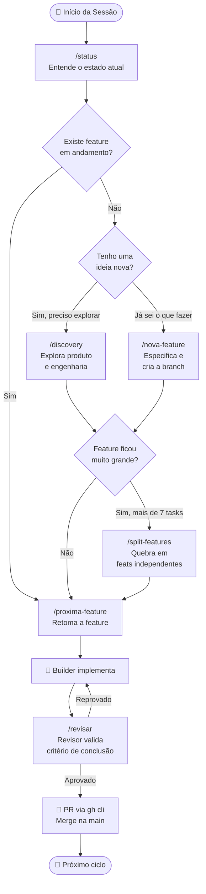

# Introdução ao Forge-SDD

Bem-vindo à documentação oficial do **forge-sdd**! Esta ferramenta foi criada para resolver um dos maiores gargalos ao desenvolver softwares com inteligência artificial: a **perda de consistência e contexto**.

---

## ⚒️ O que é o Forge-SDD?

O **forge-sdd** é um framework de **Spec-Driven Development (SDD)** (Desenvolvimento Orientado a Especificações) projetado especificamente para agentes de IA (como Gemini, Claude, Copilot e ChatGPT).

Em fluxos tradicionais de chat, a IA tende a "adivinhar" o que fazer, pulando direto para o código e gerando soluções que quebram o restante do sistema. O Forge-SDD impõe um processo rigoroso de engenharia dividido em etapas lógicas:



---

## 🧠 A Filosofia Spec-Driven Development

A premissa básica do SDD é simples: **Nenhuma linha de código deve ser escrita sem uma especificação prévia aprovada pelo usuário.**

> [!IMPORTANT]
> A especificação atua como um contrato entre você e o agente de IA. Se a especificação estiver correta e aprovada, a implementação do código tem uma taxa de acerto de quase 100%.

### Os 4 Pilares do Fluxo:
1. **Controle de Fluxo Estrito:** A IA opera com papéis pré-definidos (Orquestrador, Specifier, Builder, Revisor).
2. **Memória Persistente:** O estado ativo do projeto fica salvo em arquivos locais (`sdd/memory/progress.md`). A IA lê esse progresso no início de toda sessão.
3. **Crescimento Incremental:** Mudanças no código respeitam as regras da arquitetura e são testadas contra os critérios de conclusão.
4. **Sem Perda de Contexto:** Ao final de cada tarefa, a IA limpa o contexto e deixa o repositório pronto para a próxima evolução.

---

## 🔄 Fluxo de Desenvolvimento

O Forge-SDD organiza o trabalho em ciclos curtos e incrementais. O diagrama abaixo mostra o fluxo completo:


---

## 🚀 Como começar?

Para adotar o forge-sdd no seu projeto atual ou começar um novo:

1. **Inicialização:**
   ```bash
   npx @nathanramorim/forge-sdd@latest init
   ```
2. **Alinhamento:** Use `/constitution` para analisar seu codebase e criar regras.
3. **Planejamento:** Use `/discovery "sua ideia"` para debater arquitetura e requisitos.
4. **Ciclo:** Use `/nova-feature` e `/proxima-feature` para codificar de forma incremental.
