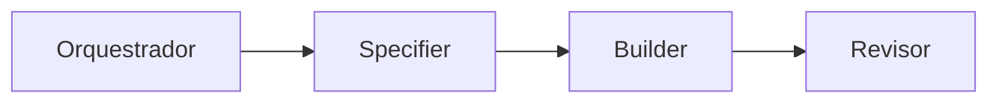

# Skills & Papéis Especializados

O **forge-sdd** organiza as responsabilidades dos agentes de IA em papéis funcionais específicos (Skills). Cada papel possui diretrizes detalhadas configuradas em arquivos `.chatmode.md` dentro de `.gemini/skills/`.

---

## 👥 Os Papéis da IA (Personas)

Ao longo do desenvolvimento de uma feature, a IA assume papéis diferentes de forma sequencial para garantir que cada etapa tenha foco e responsabilidade única.



### 1. 👑 Orquestrador
- **Arquivo:** `orquestrador.chatmode.md`
- **Foco:** Gerenciar o fluxo de trabalho e o progresso global.
- **Responsabilidade:** Inicia sessões, lê `progress.md`, valida bloqueios e seleciona a próxima tarefa do backlog. Não escreve código.

### 2. 📝 Specifier
- **Arquivo:** `specifier.chatmode.md`
- **Foco:** Mapear requisitos e arquitetura do produto.
- **Responsabilidade:** Escreve especificações técnicas, diagramas C4 (Mermaid) e detalha os critérios de aceite executáveis em cada nova feature. Não escreve código de produção.

### 3. 🔨 Builder
- **Arquivo:** `builder.chatmode.md`
- **Foco:** Codificação e implementação.
- **Responsabilidade:** Lê as especificações geradas pelo *Specifier* e escreve os arquivos de código correspondentes, resolvendo testes e lints locais. Escreve apenas código de produção.

### 4. 🔍 Revisor
- **Arquivo:** `revisor.chatmode.md`
- **Foco:** Garantia de qualidade (QA) e conformidade.
- **Responsabilidade:** Audita o código feito pelo *Builder*, roda scripts de teste e valida os critérios de conclusão antes de liberar o merge na branch `main`.

### 5. 🗄️ Archivist
- **Arquivo:** `archivist.chatmode.md`
- **Foco:** Manutenção da memória do projeto.
- **Responsabilidade:** Arquiva o histórico de sessões do `progress.md` in `progress-log.md` para evitar o estouro de contexto de tokens do modelo de IA.

---

## ⚙️ O que é uma Skill?

Uma **Skill** no ecossistema do forge-sdd é uma pasta contendo:
*   `SKILL.md`: As regras, system prompt e guia de comportamento da persona.
*   `scripts/` (opcional): Scripts utilitários executáveis pela IA para automatizar tarefas daquela skill.
*   `examples/` (opcional): Códigos de referência para guiar o aprendizado do modelo.

### Como instalar novas Skills?
Você pode importar novas habilidades da comunidade ou de repositórios privados usando o comando:
```bash
/install-skill https://github.com/usuario/skill-nome
```
