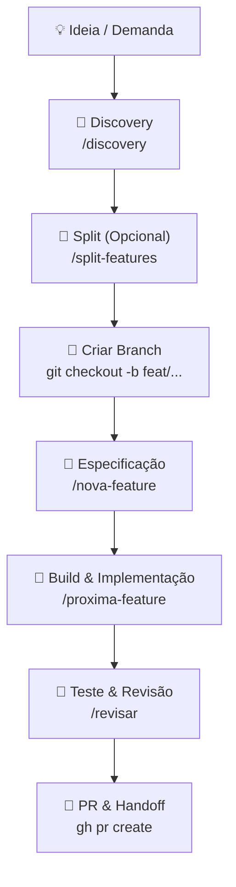

# Fluxo de Desenvolvimento e Ciclo de Vida do Projeto (Forge-SDD)

Este guia estabelece os padrões e o ciclo de vida do desenvolvimento no ecossistema do **Forge-SDD**, ensinando aos engenheiros e aos agentes de IA as regras de uso de cada ferramenta e o momento exato de acioná-los.

---

## 🔄 Visão Geral do Ciclo de Vida

O ciclo de vida de qualquer evolução no projeto segue as seguintes etapas lineares:



---

## 🔎 1. Discovery (`/discovery`)

**Quando usar:**
* Sempre que surgir uma ideia vaga, um bug complexo sem causa raiz definida, ou uma nova funcionalidade que precise de refinamento de produto e engenharia.
* **Objetivo:** Explorar os impactos técnicos, as dependências, propor abordagens de design e mapear os riscos antes de escrever qualquer código ou especificação formal.

**Comportamento:**
* O agente assume papéis sênior (Product Manager e Lead Architect) para questionar o escopo, definir restrições técnicas, sugerir arquitetura e gerar um plano preliminar.

---

## 🔀 2. Split de Features (`/split-features`)

**Quando usar:**
* Quando o plano gerado no Discovery ou a feature planejada for grande demais.

**Critérios de quebra (Desacoplamento e Arquitetura Evolutiva):**
1. **Bounded Contexts:** Se a feature abranger mais de um contexto delimitado (ex: infraestrutura de banco de dados, API backend, e telas de interface no mesmo passo), ela **deve** ser fatiada.
2. **Limite de Tarefas (Rule of 7):** Se o escopo planejado contiver **mais de 7 tarefas**, a feature é considerada grande demais para uma única branch.
3. **Sem Dependência Circular:** Ao quebrar, garanta que as sub-features não criem bloqueios ou dependências circulares entre si.
4. **Entrega Incremental e Testável:** Cada sub-feature resultante deve ser independentemente testável e funcional por si só (mesmo que com mocks), permitindo integrações incrementais.
5. **Ordem de Camadas:** A implementação deve fluir preferencialmente de baixo para cima na stack:
   $$\text{Infraestrutura / Banco de Dados} \longrightarrow \text{Domínio / Regras} \longrightarrow \text{Aplicação / APIs} \longrightarrow \text{Interface / Apresentação}$$

---

## 🌿 3. Registro e Criação de Branch (`/nova-feature`)

**Regra Crítica de Sequência:**
> [!IMPORTANT]
> **A Branch DEVE ser criada ANTES da criação do arquivo de especificação.**
> A ordem exata a ser seguida pelo Orquestrador/Specifier é:
> 1. Executar a criação da branch local: `git checkout -b feat/nome-da-feature`
> 2. Criar o arquivo `sdd/features/feat-XX-nome-da-feature.md` com a especificação e as tarefas.
> 3. Adicionar a entrada correspondente em `sdd/features/index.md` e `sdd/memory/progress.md`.

---

## 🔨 4. Implementação (`/proxima-feature`)

**Quando usar:**
* Ao iniciar o desenvolvimento de fato de uma feature marcada como `todo` em `sdd/memory/progress.md`.

**Comportamento:**
* O Orquestrador muda o status da feature para ativo, delega as tarefas para o Builder e coordena a execução incremental e focada.

---

## 🧪 5. Revisão (`/revisar`)

**Quando usar:**
* **Sempre** antes de finalizar uma feature e criar o Pull Request.

**Verificações Obrigatórias do Revisor:**
* [ ] Os critérios de conclusão e as tarefas definidos na especificação foram totalmente atendidos.
* [ ] Os testes locais estão passando (`go test ./...` ou comando equivalente da stack).
* [ ] Linters e validadores de código rodam limpos (`golangci-lint run`).
* [ ] Arquivos de progresso e índice (`progress.md` e `index.md`) foram devidamente atualizados refletindo o status `done`.

---

## 🚀 6. Operações no GitHub (Uso do `gh` CLI)

Sempre que a tarefa envolver interação com o repositório remoto (GitHub) para submissão de código e gerenciamento de Pull Requests, **prefira utilizar a ferramenta CLI `gh` oficial**, em vez de comandos git puros ou URLs web manuais.

**Comandos Recomendados:**
* **Criar Pull Request:**
  ```bash
  gh pr create --title "feat(nome): descricao curta" --body "Correcao/Implementacao de ..."
  ```
* **Visualizar status do PR:**
  ```bash
  gh pr status
  ```
* **Realizar Merge (após aprovação/revisão):**
  ```bash
  gh pr merge --squash --delete-branch
  ```
* Caso a ferramenta `gh` não esteja instalada no ambiente, caia para o git puro e instrua o usuário a abrir o PR de forma amigável através do link gerado no terminal.
