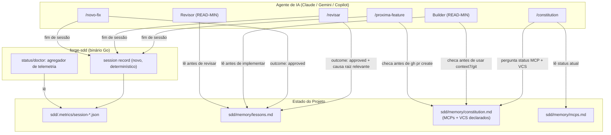

# Critérios Técnicos 01 — Simplificação e Aprendizado Contínuo do Forge-SDD

Este documento define os critérios de aceitação técnicos, restrições e o diagrama C4 da solução para as evoluções propostas em `discovery-01`.

## 1. Critérios de Aceitação Técnicos

1. **Telemetria code-enforced (pré-requisito das demais):**
   * A gravação de `sdd/.metrics/session-<ISO8601>.json` deixa de depender exclusivamente de uma instrução em linguagem natural no último passo de `/proxima-feature`. Deve existir um mecanismo determinístico (subcomando do binário Go, ex.: `forge-sdd session record`, ou script/hook acionado por múltiplos comandos) que grave o schema já existente (`sdd/.metrics/schema.json`).
   * O disparo deve acontecer em **todos** os pontos de saída de sessão que hoje existem — não apenas `/proxima-feature`, mas também `/revisar` e `/novo-fix` — para que uma sessão que termina antes de chegar a `/proxima-feature` ainda produza telemetria com `outcome` refletindo o estado real (`approved`/`rejected`/`blocked`).
   * Critério de verificação: simular uma sessão que só executa `/revisar` (sem `/proxima-feature`) e confirmar que um arquivo `session-*.json` válido é produzido.

2. **Agregador mínimo de telemetria:**
   * `/status` ou `/doctor` (não criar comando novo) ganha uma seção que resume `sdd/.metrics/session-*.json`: contagem por `outcome`, comandos/fases mais frequentes.
   * Não requer novo armazenamento — leitura direta dos arquivos JSON existentes.

3. **Artefato de aprendizado (`sdd/memory/lessons.md`):**
   * Novo arquivo, budget ≤ 2 KB (mesmo padrão de orçamento de `progress.md`), formato de lista curta `padrão → correção → referência da feature/fix`.
   * Atualizado de forma determinística (mesmo mecanismo do item 1) ao final de `/revisar` ou `/novo-fix` quando o outcome é `approved` e a causa raiz identificada se repete ou é significativa.
   * Lido no passo READ-MIN de Builder e Revisor (junto com `progress.md`), antes de iniciar qualquer implementação — sem exigir leitura de todo o histórico de fixes.

4. **Ferramentas configuráveis por projeto na Constituição:**
   * `sdd/memory/constitution.md` (e seu `.tmpl`) ganha uma seção nova declarando, por projeto: (a) status real de cada MCP configurado (`ativo`/`indisponível`, populado a partir de `mcps.md` existente, que passa a ser efetivamente lido); (b) o VCS/work-item system em uso (`github` / `azure-devops` / `nenhum`).
   * `constitution.prompt.md` (nos 3 agentes) pergunta isso ao gerar/atualizar a constitution — mesmo padrão já usado para `naming_convention` e nível de linguagem.
   * Qualquer prompt que hoje assume `gh pr create --fill` incondicionalmente passa a checar esse campo antes de executar:
     - `github` → comportamento atual, sem mudança.
     - `azure-devops` → instrução equivalente documentada (ex.: `az repos pr create` ou link de criação manual no padrão Azure DevOps).
     - `nenhum` → deixa a branch pronta e informa o usuário, sem tentar nenhum comando de VCS.
   * Qualquer prompt que hoje assume `context7`/`git` MCP incondicionalmente (Regra 5 da Constituição, `CLAUDE.md`, chatmode Builder) passa a checar o status declarado antes de instruir o uso; se `indisponível`, usa alternativa (documentação já conhecida, ou pula a etapa) em vez de assumir resposta do MCP.
   * `sdd/memory/mcps.md` deixa de ser tabela estática nunca lida — passa a ser fonte efetiva de pelo menos um prompt.

5. **Lifecycle único:**
   * Um documento fonte da verdade (`sdd/FLOW.md`, mantendo os 5 estágios já usados em `CLAUDE.md`: Problema → Proposta → Refinamento → Execução → Entrega, mapeados aos 5 estágios do processo real: Discovery → Especificação → Split/Refinamento → Build → Review/Handoff).
   * `CLAUDE.md` e os chatmodes Orquestrador passam a **citar o estágio**, não reescrever a sequência completa — reduzindo o número de lugares que precisam mudar quando um passo muda.

6. **Redução de duplicação:**
   * A lógica de nomenclatura (`sequencial`/`hash`/`workitem`), hoje copiada literalmente em `discovery.prompt.md`, `nova-feature.prompt.md` e `novo-fix.prompt.md`, passa a viver em um único bloco referenciado pelos três (ex.: incluído via template parcial ou citado como "ver Regra X da Constituição"), sem duplicar o texto.

7. **Nenhuma capacidade removida sem alternativa equivalente:**
   * Toda consolidação desta rodada documenta explicitamente "antes/depois" na feature correspondente; nenhum comando existente é excluído — apenas sua implementação redundante.

## 2. Diagrama C4 — Telemetria Determinística, Lições e Ferramentas Configuráveis (Mermaid)

## 3. Restrições

- Nenhuma mudança pode quebrar o contrato atual dos comandos públicos do CLI (`init`, `doctor`, `destroy`, `update` — Regra 10 da Constituição); um novo subcomando de telemetria deve ser aditivo.
- Templates continuam embutidos via `embed.FS` (Regra 3).
- `go vet ./...` e `go build` devem passar após cada task (Regras 6-7).
- O caminho GitHub/`gh` já testado não pode regredir quando o campo de VCS não estiver preenchido (default deve ser `github`, preservando comportamento atual em projetos existentes que não passarem por `/constitution` novamente).
- `sdd/memory/lessons.md` respeita orçamento de tamanho (≤ 2 KB), evitando crescimento ilimitado — pode exigir rotação/arquivamento futuro, fora do escopo desta rodada.
