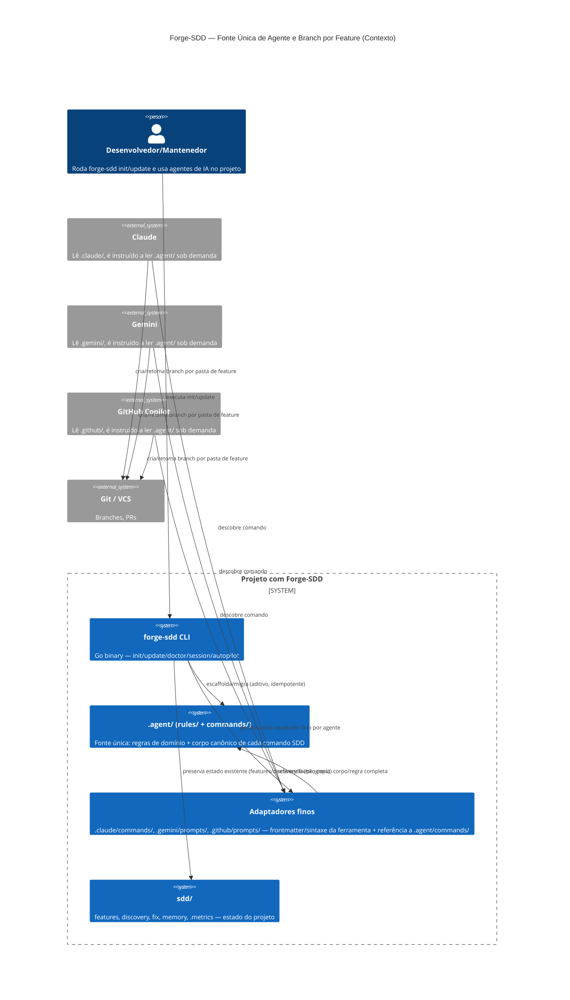
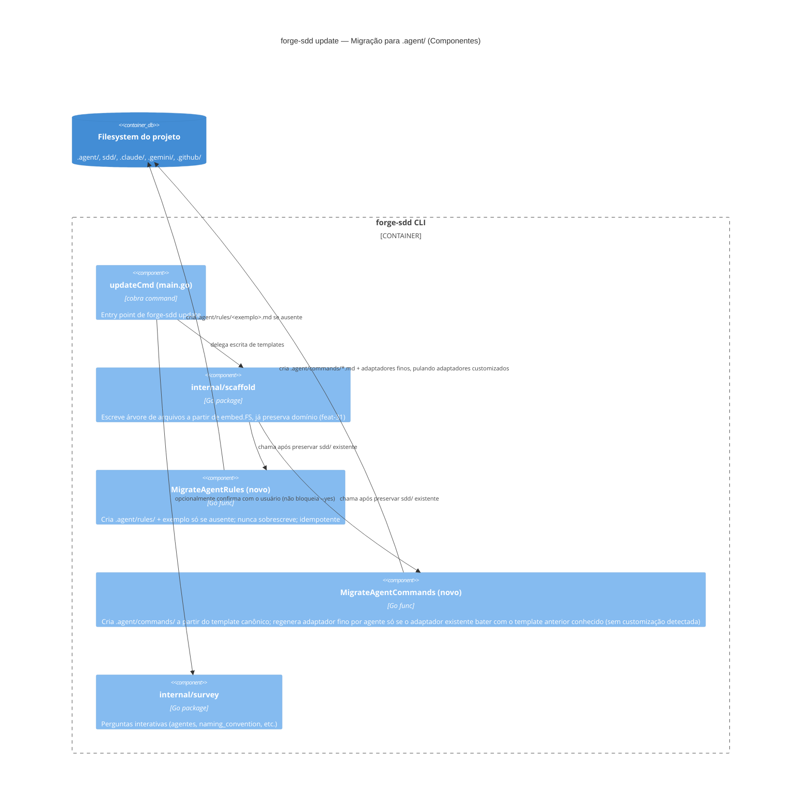

# Critérios Técnicos 02 — Fonte Única de Agente (`.agent/`) e Branch por Feature

## 1. Restrições

- Regra 3 da Constituição: templates embutidos via `embed.FS` — `.agent/rules/` e `.agent/commands/` entram em `internal/scaffold/templates/`, nunca como asset externo em runtime.
- Regra 10 da Constituição: CLI expõe hoje só `init` e `update` como comandos públicos — a migração para `.agent/` deve entrar no fluxo já existente de `update` (mesmo ponto de extensão do feat-31), sem novo subcomando público.
- Regra 13 da Constituição (agrupamento em subpastas) já define que quebras de feature vivem em `sdd/features/feat-XX-nome/`; este pacote formaliza o comportamento de branch correspondente, sem mudar a convenção de subpastas em si.
- Não sobrescrever arquivos existentes (decisão resolvida da Constituição) — migração de `.agent/` deve ser aditiva e idempotente; se um adaptador de agente (`.claude/commands/*.md`, etc.) tiver conteúdo divergente do template original conhecido (indício de customização manual), a migração pula esse arquivo e avisa, em vez de sobrescrever.
- Cada ferramenta de agente mantém seu próprio mecanismo de descoberta de comando (`.claude/commands/`, `.gemini/prompts/`, `.github/prompts/`) — essas três pastas continuam existindo fisicamente; o que muda é que deixam de conter o corpo completo da instrução, passando a conter só frontmatter/sintaxe de invocação específicos da ferramenta + uma referência a `.agent/commands/<comando>.md`.
- **A descoberta/autocomplete de `/comando` é por nome de arquivo, não por conteúdo do corpo** — confirmado inspecionando os templates atuais: Claude e Gemini registram o comando pelo nome do arquivo dentro de `.claude/commands/`/`.gemini/prompts/`; Copilot usa o frontmatter `description`/`agent` de `.github/prompts/*.md` para o menu. O adaptador fino preserva nome de arquivo, localização e esse metadado por ferramenta — só o corpo (instrução completa) é substituído pelo ponteiro a `.agent/commands/`. Isso garante que o `/` de cada agente continua sugerindo os mesmos comandos, sem regressão de UX.
- Vendor-agnostic: `.agent/rules/` e `.agent/commands/` não podem depender de sintaxe proprietária de nenhum agente — leitura de Markdown puro, mesmo mecanismo já usado para `sdd/memory/progress.md`/`lessons.md`.
- `--dry-run` nunca cria arquivos (Regra 9) — a migração de `.agent/` respeita esse contrato quando invocada via `update --dry-run`.

## 2. C4 Model — Contexto

**Decisão-chave:** `.agent/` é a única fonte editável de comportamento (regra ou comando). `.claude/`, `.gemini/`, `.github/` continuam existindo (restrição de cada ferramenta), mas viram adaptadores finos e gerados — nunca cópias de conteúdo mantidas manualmente. Isso resolve tanto o pedido original de "rules sem duplicar" quanto o pedido de expansão ("parar de criar 3 pastas divergentes toda vez").

## 3. C4 Model — Componentes (fluxo de update/migração)

## 4. Critérios de Aceitação (macro, refinados em `/split-features`)

1. `forge-sdd init` em projeto novo escaffolda `.agent/rules/` (com exemplo mínimo, ex: `design-system.md` comentado) e `.agent/commands/` (corpo canônico de cada um dos 12 comandos SDD), embutidos via `embed.FS`.
2. Os adaptadores gerados em `.claude/commands/`, `.gemini/prompts/`, `.github/prompts/` contêm só o necessário à ferramenta (frontmatter, sintaxe de invocação) e uma instrução para ler `.agent/commands/<comando>.md` — sem duplicar o corpo da instrução completa. Nenhum dos 12 comandos existentes perde comportamento nessa transição (mesma cobertura de conteúdo, validável comparando adaptador antigo vs. novo par adaptador+corpo canônico).
3. `forge-sdd update` em projeto existente cria `.agent/rules/` e `.agent/commands/` se ausentes, sem alterar `sdd/features/`, `sdd/discovery/`, `sdd/fix/*`, `sdd/memory/progress.md`. Regras já existentes em `.agent/rules/` nunca são sobrescritas.
4. `forge-sdd update` só converte um adaptador existente (`.claude/commands/*.md`, etc.) para a forma fina/referenciada se o conteúdo atual bater com o template original conhecido da versão anterior (sem edição manual detectada); caso contrário, pula o arquivo e reporta ao usuário quais adaptadores não puderam ser migrados automaticamente.
5. `forge-sdd update --dry-run` reporta a criação/conversão de `.agent/` e dos adaptadores na árvore impressa, sem escrever nenhum arquivo real.
6. Prompts `/nova-feature`, `/proxima-feature`, `/novo-fix` (três agentes, agora via corpo canônico único em `.agent/commands/`) passam a: (a) detectar quando a feature/fix corrente é uma subpasta (`sdd/features/feat-XX-nome/*.md`) e tratar a pasta inteira como unidade de uma única branch agrupando as subtarefas; (b) perguntar obrigatoriamente qual branch usar como ponto de partida (default `main`); (c) checar se já existe uma branch de feature anterior para aquela pasta (`git branch --list feat/XX-*`) e perguntar se deve continuar a partir dela em vez de recriar.
7. Comportamento de branch para features sem subpasta (arquivo único, formato atual) permanece inalterado — sem regressão nos fluxos já cobertos por golden fixtures.
8. `go build`, `go vet ./...` e `go test ./...` passam; golden fixtures de `internal/scaffold` regeneradas cobrindo `.agent/rules/`, `.agent/commands/` e os adaptadores finos dos três agentes.
9. Documentação (README/release notes) cita `.agent/` (rules + commands), o novo modelo de adaptador fino, e a nova pergunta de branch — respeitando Regra 12 da Constituição (release notes com prévia de comando/prompt e agente identificado).
