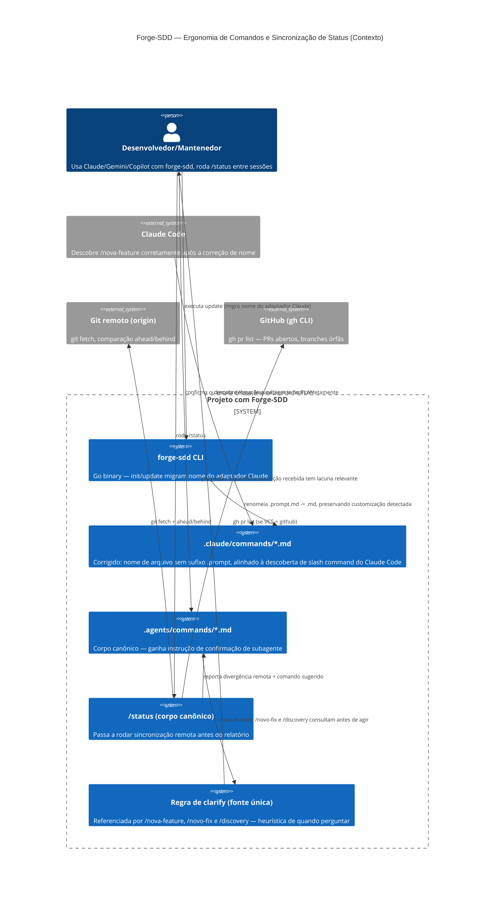
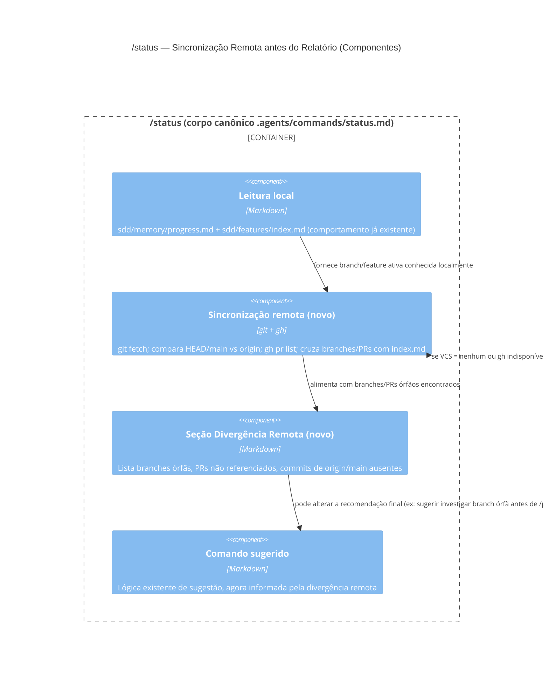

# Critérios Técnicos 03 — Confirmação de Subagente, Comando Claude Quebrado, `/status` sem Sincronização e Clarify

## 1. Restrições

- Regra 3 da Constituição: templates embutidos via `embed.FS` — a correção de nome do adaptador Claude entra em `internal/scaffold/templates/`, nunca como asset externo em runtime.
- Regra 10 da Constituição: CLI expõe hoje só `init` e `update` como comandos públicos — a migração de nome de arquivo (`.prompt.md` → `.md` no adaptador Claude) entra no fluxo já existente de `update`, sem novo subcomando público.
- Não sobrescrever arquivos existentes (decisão resolvida da Constituição) — a migração de nome do adaptador Claude deve detectar se o usuário já customizou manualmente o conteúdo de um `.claude/commands/*.prompt.md`; se sim, preservar o conteúdo ao renomear (não descartar customização), avisando o usuário.
- **Escopo da correção de nomenclatura é só o adaptador Claude.** Gemini (`.gemini/prompts/*.prompt.md`) e Copilot (`.github/prompts/*.prompt.md`) mantêm a extensão `.prompt.md` — é a convenção correta e esperada de cada ferramenta. Nenhuma mudança nesses dois adaptadores faz parte deste pacote.
- Vendor-agnostic onde aplicável: a nova etapa de "confirmação de subagente" no lifecycle deve ser descrita de forma agnóstica de ferramenta (não assume que só Claude tem subagentes) — Gemini/Copilot que não suportem o conceito simplesmente tratam a pergunta como não aplicável ou a omitem, sem quebrar o corpo canônico compartilhado.
- `git fetch`/`gh pr list` usados pela nova etapa de sincronização de `/status` já são consistentes com a Regra "VCS / Work Item System" da Constituição (`github` hoje) — se o campo for `nenhum`, a etapa de sincronização remota deve ser pulada silenciosamente (mesmo comportamento já definido para não tentar comandos de VCS).
- `--dry-run` nunca cria arquivos (Regra 9) — a migração do nome do adaptador Claude respeita esse contrato quando invocada via `forge-sdd update --dry-run`.
- **Clarify deve ser uma regra única, referenciada pelos três comandos** (`/nova-feature`, `/novo-fix`, `/discovery`), mesmo princípio já usado em `sdd/memory/naming-convention.md` (fonte única citada, não copiada em cada corpo canônico) — evita divergência da heurística entre os três comandos ao longo do tempo.
- Clarify é **condicional, não obrigatório a cada invocação** — pedidos já claros e completos não geram pergunta forçada; a heurística de "quando perguntar" precisa ser objetiva o suficiente para não depender de julgamento livre do modelo a cada sessão.

## 2. C4 Model — Contexto

**Decisão-chave:** três correções independentes, sem dependência técnica forte entre si — podem ser feitas em paralelo ou em qualquer ordem, mas a correção de nome do adaptador Claude tem prioridade por já quebrar o uso padrão hoje (comando sugerido não executa).

## 3. C4 Model — Componentes (fluxo de `/status` com sincronização)

## 4. Critérios de Aceitação (macro, refinados em `/split-features`)

1. Os 12 arquivos de comando em `.claude/commands/` (repositório) e o template-fonte correspondente (`internal/scaffold/templates/agents/claude/.claude/commands/*.md.tmpl`, hoje `*.prompt.md.tmpl`) são renomeados para `<comando>.md` (sem `.prompt`), preservando o conteúdo (referência a `.agents/commands/<comando>.md`). Golden fixtures de `internal/scaffold` atualizadas e testes passando.
2. `forge-sdd init` em projeto novo escaffolda `.claude/commands/*.md` (sem sufixo `.prompt`); Gemini/Copilot continuam gerando `*.prompt.md` sem alteração.
3. `forge-sdd update` em projeto existente migra `.claude/commands/*.prompt.md` remanescente para `*.md`, de forma aditiva/idempotente: se o conteúdo do arquivo antigo bater com o template conhecido, renomeia; se houver customização detectada, preserva o conteúdo ao criar o novo nome e avisa o usuário sobre o arquivo antigo remanescente (sem apagar silenciosamente).
4. `sdd/FLOW.md`, `.agents/commands/*.md` e qualquer outro texto de handoff continuam recomendando `/nova-feature`, `/status` etc. sem sufixo — agora compatível de fato com a descoberta de slash command do Claude Code.
5. `.agents/commands/status.md` (corpo canônico) ganha uma etapa de sincronização remota executada antes de montar o relatório: `git fetch`, comparação ahead/behind da branch atual e de `main` contra `origin`, e (se VCS = `github`) `gh pr list` cruzado com `sdd/features/index.md`. Se VCS = `nenhum` ou `gh` indisponível/sem rede, a etapa é pulada com um aviso curto no relatório, sem erro fatal.
6. Relatório de `/status` ganha uma seção "Divergência Remota" (só aparece quando há algo a reportar) listando: branches remotas sem feature/fix correspondente no índice, PRs abertos não referenciados em `progress.md`/`index.md`, e commits em `origin/main` ainda não incorporados à branch ativa.
7. O cálculo de "Próximo comando sugerido" (regra já existente em `.agents/commands/status.md`) passa a considerar a divergência remota encontrada — por exemplo, recomendando investigar uma branch órfã antes de sugerir `/proxima-feature` ou `/discovery`.
8. O protocolo de lifecycle (`CLAUDE.md`/`GEMINI.md`/chatmode Copilot ou ponto único equivalente) ganha uma etapa explícita no passo `PLAN`: antes de iniciar a próxima atividade/comando, perguntar objetivamente se deve ser delegada a um subagente, com critério simples e documentado (ex: tarefas de varredura/pesquisa extensa tendem a "sim"; edição pontual tende a "não") — decisão final sempre do usuário, nunca automática.
9. Em ferramentas sem conceito de subagente, a etapa 8 é tratada como não aplicável (omitida), sem quebrar o corpo canônico compartilhado entre os três agentes.
10. Nova regra de clarify vive em um único arquivo/fonte referenciado (mesmo padrão de `sdd/memory/naming-convention.md`) e é citada por `.agents/commands/nova-feature.md`, `.agents/commands/novo-fix.md` e `.agents/commands/discovery.md` — nenhum dos três copia a heurística no próprio corpo.
11. A regra de clarify define sinais objetivos de "lacuna relevante" (ex: ausência de critério de aceitação implícito, escopo com mais de uma interpretação plausível, dependência externa não mencionada) e instrui: se nenhum sinal for detectado, seguir direto sem pergunta; se algum for detectado, fazer uma rodada objetiva de perguntas ao usuário antes do PASSO 1 (`nova-feature`/`novo-fix`) ou antes de gerar os três artefatos (`discovery`).
12. `go build`, `go vet ./...` e `go test ./...` passam; nenhuma regressão nos fluxos de `init`/`update` já cobertos por golden fixtures.
13. Documentação (README, release notes) reflete a correção de nome do adaptador Claude, a nova etapa de `/status` e a nova regra de clarify, identificando explicitamente agente/comando conforme Regra 12 da Constituição.
