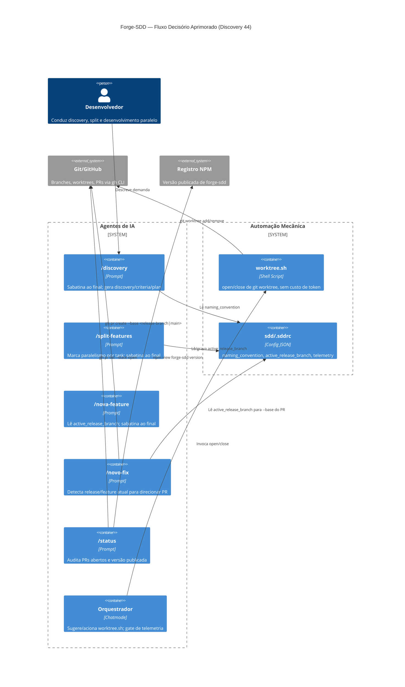

# Critérios Técnicos 44 — Aprimoramento do Fluxo Decisório do Forge-SDD

## Restrições
- Não deve haver aumento de custo de token nas operações mecânicas (abrir/fechar worktree): essas ações são resolvidas por shell script, nunca por texto gerado pelo agente.
- As mudanças de prompt devem ser replicadas nos três agentes suportados hoje pelos prompts existentes (Claude, Gemini) — Copilot só onde já existir prompt equivalente.
- `sdd/.sddrc` é a única fonte de verdade de configuração; nenhuma decisão de branch/paralelismo deve ficar hardcoded em prompt.
- `sdd-daemon.sh` e outros scripts em `sdd/scripts/` já existem como precedente de automação mecânica fora do binário Go — o novo script de worktree segue o mesmo padrão de pasta.

## Integridade
- O script de worktree deve ser idempotente: rodar "open" duas vezes para a mesma task não deve corromper o estado; "close" numa worktree inexistente deve falhar de forma clara, não silenciosa.
- `active_release_branch` em `.sddrc` deve ser validada (branch existe localmente ou no remoto) antes de ser usada como base de PR; se inválida, cai para `main` com aviso.
- A checagem de versão publicada no NPM em `/status` deve degradar graciosamente sem rede/token de acesso (reporta "não verificável" em vez de travar o comando).

## Critérios de Aceitação Executáveis

1. **Sabatina ao final de `/discovery`, `/split-features`, `/nova-feature`:**
   * Cada um dos três prompts, ao final, apresenta as decisões relevantes tomadas (escopo, paralelismo sugerido, branch de destino) e pergunta se o usuário confirma, quer pular (aceitar sugestão), ou quer sobrescrever.
   * A resposta do usuário (confirmar/pular/sobrescrever) deve ser refletida no artefato gerado (`plan-ID-*.md` ou spec de feature/fix).

2. **`sdd/scripts/worktree.sh`:**
   * Suporta `worktree.sh open <branch>` (cria `git worktree add` numa pasta padrão, ex. `.worktrees/<branch>`) e `worktree.sh close <branch>` (remove a worktree e opcionalmente a branch local se já mesclada).
   * É chamado pelo orquestrador como ação sugerida (comando de shell pronto, não lógica gerada) quando o `plan-ID-*.md` marca tasks como paralelizáveis, e também fica acessível como comando direto no chat (ex. `/worktree open <branch>`).
   * Ao final da implementação completa de uma task paralela, o orquestrador sugere `worktree.sh close <branch>` antes/junto da criação do PR.

3. **`active_release_branch` em `sdd/.sddrc`:**
   * Nova chave opcional `active_release_branch` (string, nome de branch) em `sdd/.sddrc`.
   * `/novo-fix` e `/nova-feature` (e o fluxo de PR do `/proxima-feature`) devem usar essa chave como `--base` do `gh pr create` quando presente e válida; caso ausente ou inválida, usar `main`.
   * `/nova-feature`/`/novo-fix` devem inferir e sugerir gravar essa chave quando detectarem que a branch atual segue o padrão `feat/release-*` ou `release/*`.

4. **`/status` audita PRs abertos e versão publicada:**
   * Executa `gh pr list --state open` (quando `gh` disponível) e lista os PRs em aberto no relatório.
   * Compara `sdd/.sdd-version` com `npm view forge-sdd version` (quando rede disponível) e sinaliza se a versão local ainda não foi publicada.
   * Se `gh` ou rede não estiverem disponíveis, reporta "não verificável" para o item correspondente, sem falhar o comando inteiro.
   * O relatório final do `/status` deve recomendar resolver PRs abertos/publicar release pendente antes de sugerir iniciar novo discovery/feature.

## C4 Model — Visão de Componentes

