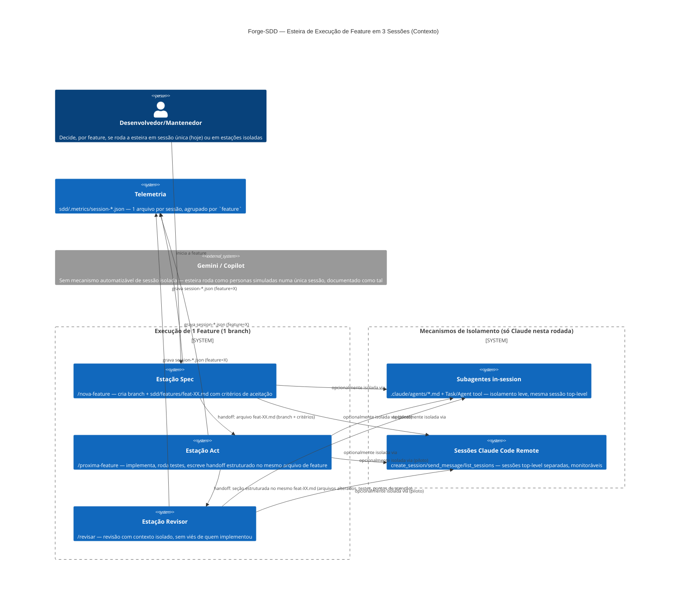

# Critérios Técnicos 53 — Esteira de Execução de Feature em 3 Sessões (Spec → Act → Revisor)

Este documento define os critérios de aceitação técnicos, restrições e o diagrama C4 da solução para as evoluções propostas em `discovery-53`.

## 1. Critérios de Aceitação Técnicos

1. **As 3 estações são as 3 seções já existentes, não comandos novos:**
   * Spec = `/nova-feature` (branch + especificação). Act = `/proxima-feature` (implementação). Revisor = `/revisar`. Nenhum comando novo é criado — o critério de aceitação é que cada um desses três **pode** ser executado como sessão isolada, sem alterar seu comportamento quando executado na sessão única de hoje (compatibilidade retroativa obrigatória).
2. **Handoff estruturado entre estações, em arquivo (não só em texto de conversa):**
   * Spec → Act: o arquivo `sdd/features/feat-XX-nome.md`/`fix-XX-nome.md` já cumpre esse papel (branch criada + critérios de aceitação executáveis) — critério de aceitação é que nada precisa ser inventado aqui, só documentado como o contrato formal Spec→Act.
   * Act → Revisor: hoje só existe como texto solto no handoff de fim de `/proxima-feature`. Critério de aceitação: um formato mínimo e determinístico (lista de arquivos alterados, comando(s) de teste executado(s) e resultado, pontos de atenção) — anexado ao final da seção "Handoff" do arquivo de feature/fix (mesmo arquivo já usado pelo Spec→Act, sem criar artefato novo).
3. **Dois mecanismos de sessão isolada, escopados separadamente (Claude apenas nesta rodada):**
   * **Subagentes in-session** (`.claude/agents/*.md` + Task/Agent tool) — mesma sessão top-level, contexto isolado por chamada. Critério: viável hoje sem mudança de infraestrutura, apenas definição de arquivos de subagente para Builder/Revisor.
   * **Sessões Claude Code Remote separadas** (`create_session`, `send_message`, `list_sessions`, `create_trigger`) — sessões top-level de fato independentes. Critério: documentar o fluxo de criação/mensageria/monitoramento como piloto opcional, não obrigatório — usuário decide por feature se quer esteira "leve" (subagentes) ou "pesada" (sessões separadas).
4. **Gemini e Copilot documentados como "sem isolamento automatizável" nesta rodada** — nenhuma tentativa de emular sessão separada nesses dois agentes. Critério de aceitação: a esteira continua funcionando neles como hoje (personas simuladas numa única sessão), sem regressão, e a documentação declara essa assimetria explicitamente (não implicitamente).
5. **Telemetria correlaciona múltiplas sessões da mesma feature:**
   * `sdd/.metrics/schema.json` ganha um campo de agrupamento (reaproveitar `feature`, que já é o caminho relativo completo da feature/task, como chave — sem introduzir um novo `run_id` se `feature` já for suficiente para agrupar).
   * `/status`/`/doctor` (comandos já existentes, nenhum novo) conseguem reconstruir, a partir de N arquivos `session-*.json` com o mesmo `feature`, quais estações já rodaram e em qual `outcome`.
6. **Branch única por feature preservada (Regra 15 da Constituição):** critério de aceitação explícito — as 3 estações, isoladas ou não, sempre operam na mesma branch (`feat/XX-nome`/`fix/XX-nome`), nunca uma branch por estação. Qualquer piloto de sessão separada precisa validar isso como teste de aceitação (Act, numa sessão nova, faz checkout da branch criada pelo Spec, não cria uma nova).
7. **`--dry-run`/idempotência não regridem:** se o piloto envolver o CLI (ex.: um subcomando futuro para orquestrar handoff), segue a Regra 9 (dry-run nunca cria arquivo) e a Regra 10 (CLI expõe só `init`/`update` como comandos públicos hoje — qualquer subcomando novo de orquestração de sessão precisa de decisão explícita do usuário para estender a Regra 10, não pode ser assumido implicitamente).

## 2. Diagrama C4 — Esteira Spec → Act → Revisor (Mermaid)

