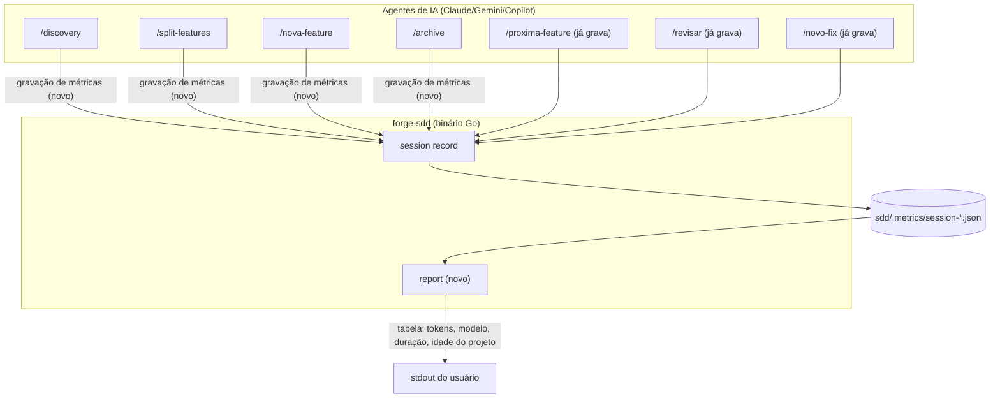

# Critérios Técnicos 55 — Telemetria com Cobertura Total e Relatório de Métricas

## Restrições

- **Compatibilidade retroativa do schema:** `sdd/.metrics/schema.json` não
  ganha campo obrigatório novo. Sessões já gravadas (sem indicação
  explícita de tipo) continuam sendo lidas pelo `forge-sdd report` —
  o tipo (`discovery` | `feature` | `fix`) é **inferido** do prefixo do
  campo `feature` (`sdd/discovery/...` → discovery; `sdd/features/fix-...`
  ou caminho contendo `fix-` → fix; qualquer outro caminho sob
  `sdd/features/` → feature).
- **Fonte única de comando:** a nova etapa "Gravação de Métricas" em
  `/discovery`, `/split-features`, `/nova-feature` e `/archive` é escrita
  uma vez em `.agents/commands/*.md` (canônico) e nos templates
  correspondentes em `internal/scaffold/templates/.agents/commands/*.md.tmpl`
  — nunca duplicada nos adaptadores por agente (Regra já estabelecida em
  feat-02/feat-03).
- **Determinístico, não narrado pelo LLM:** tanto a gravação quanto o
  relatório são chamadas de comando do binário (`forge-sdd session
  record`, novo `forge-sdd report`) — o agente executa o comando, não
  monta JSON/tabela manualmente.
- **Sem novo arquivo por padrão:** `forge-sdd report` imprime no
  terminal; não escreve em `sdd/` (evita mais um artefato para manter
  dentro do orçamento de arquivos do projeto).

## C4 Model (Mermaid) — Visão da Solução

## Critérios de Aceitação Executáveis

1. `.agents/commands/discovery.md`, `split-features.md`, `nova-feature.md`
   e `archive.md` (e os `.md.tmpl` correspondentes em
   `internal/scaffold/templates/.agents/commands/`) ganham um passo final
   "Gravação de Métricas (determinística)" análogo ao já existente em
   `novo-fix.md`/`revisar.md`/`proxima-feature.md`, condicionado a
   `telemetry.enabled` em `sdd/.sddrc`.
2. `forge-sdd report --dir <path>` (novo comando Cobra em
   `cmd/forge-sdd/report.go`) lê todos os `sdd/.metrics/session-*.json`,
   classifica cada um por tipo via prefixo do campo `feature`, e imprime
   uma tabela com: tokens de entrada+saída totais por item (feature/fix/
   discovery), lista de modelos únicos usados por item, duração total por
   item, e duração agregada de todas as sessões.
3. O mesmo comando imprime, ao final, "idade medida do projeto": diferença
   entre o timestamp da métrica mais antiga e o da mais recente
   (extraído do próprio nome do arquivo `session-<ISO8601>.json`, sem
   depender de parsing do conteúdo).
4. Teste unitário cobre: diretório sem métricas (mensagem clara, exit 0),
   métricas antigas sem padrão de path reconhecível (caem em categoria
   "outro", não quebram o comando), e um conjunto misto de
   discovery/feature/fix com tokens/modelos diferentes (soma e listagem
   corretas).
5. `forge-sdd doctor` não duplica a lógica de agregação — continua usando
   `AggregateSessionMetrics` (ou uma versão estendida dela) já existente
   em `cmd/forge-sdd/session.go`; o novo `report` reaproveita essa mesma
   função-base sem copiar o parsing de arquivo.
6. `go build ./...` e `go test ./...` passam sem quebrar nenhum teste
   existente (`TestAggregateSessionMetrics`, golden tests de scaffold).
