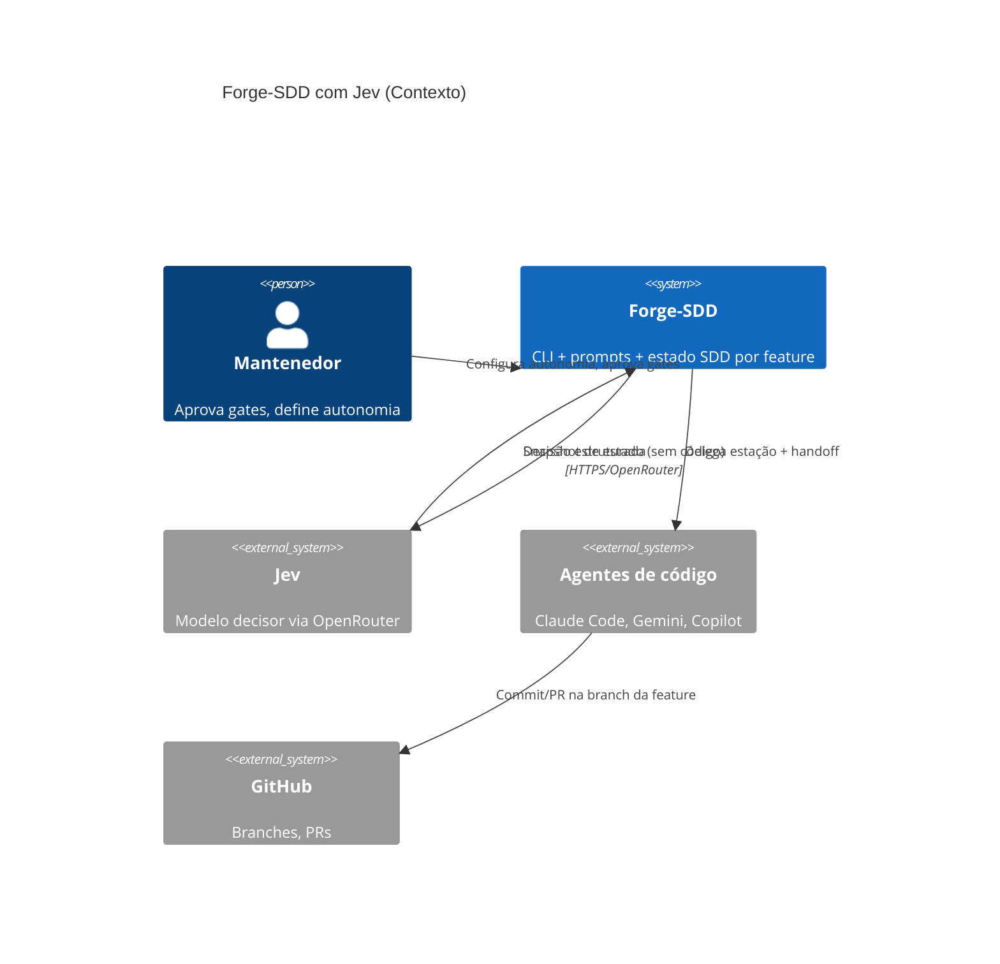
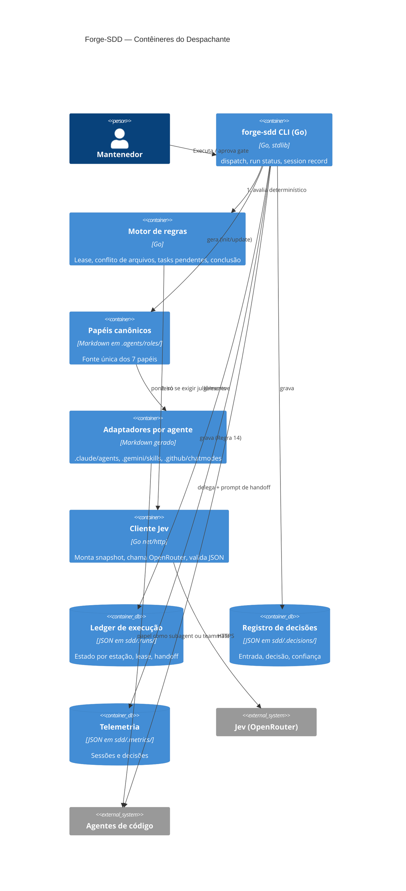
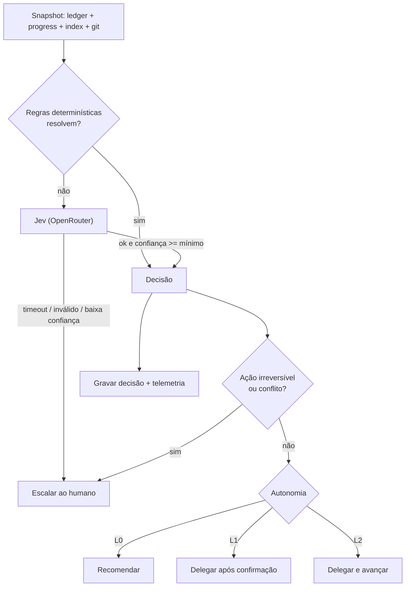
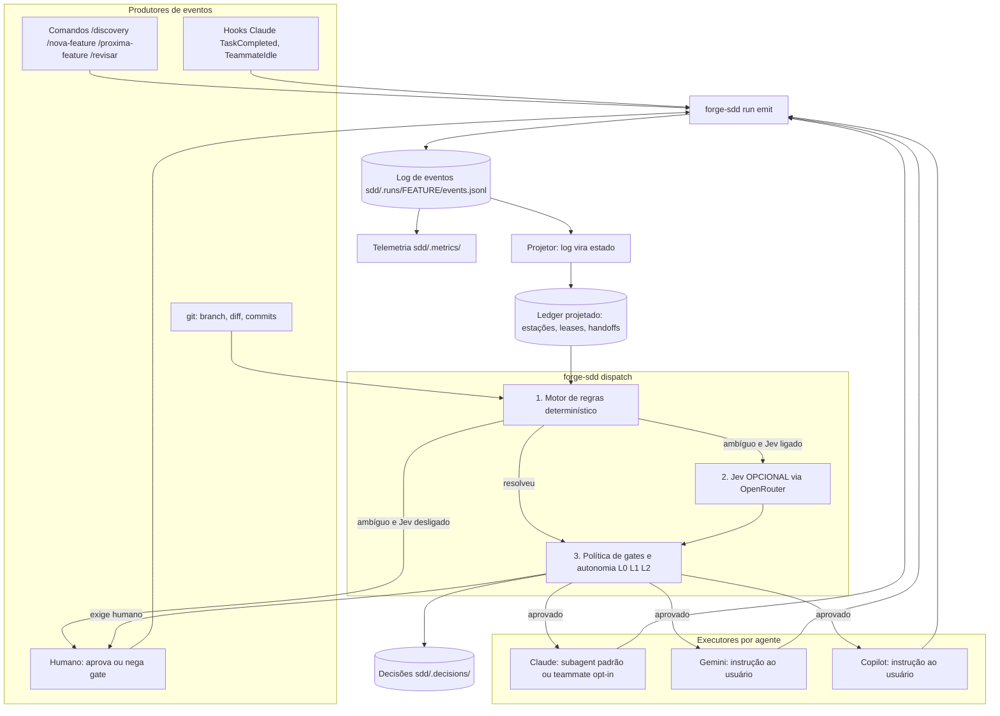
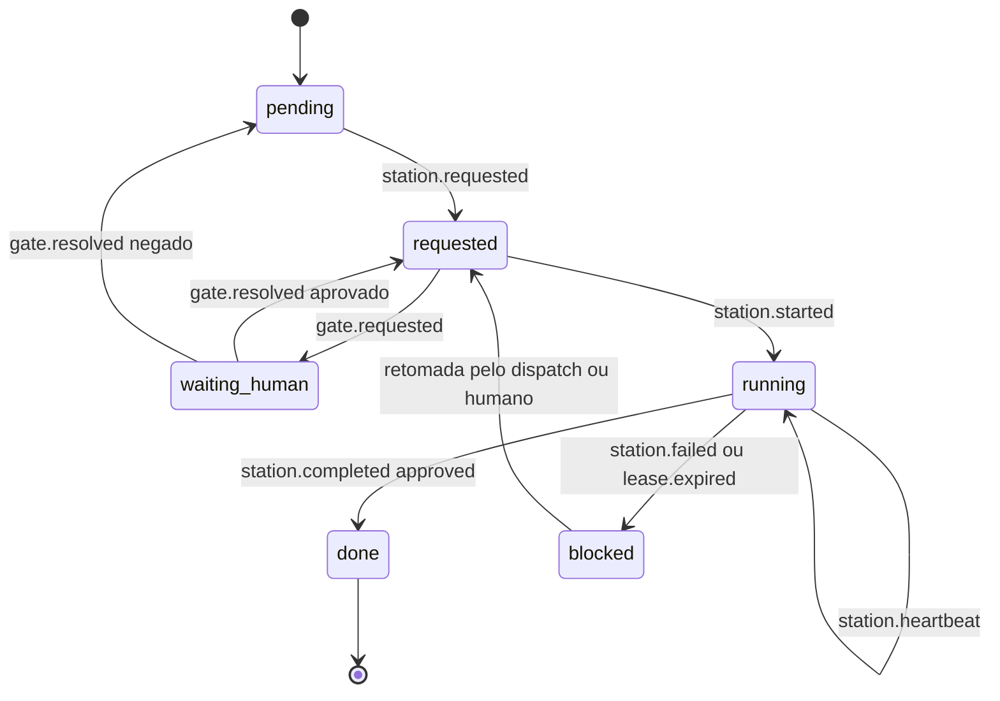
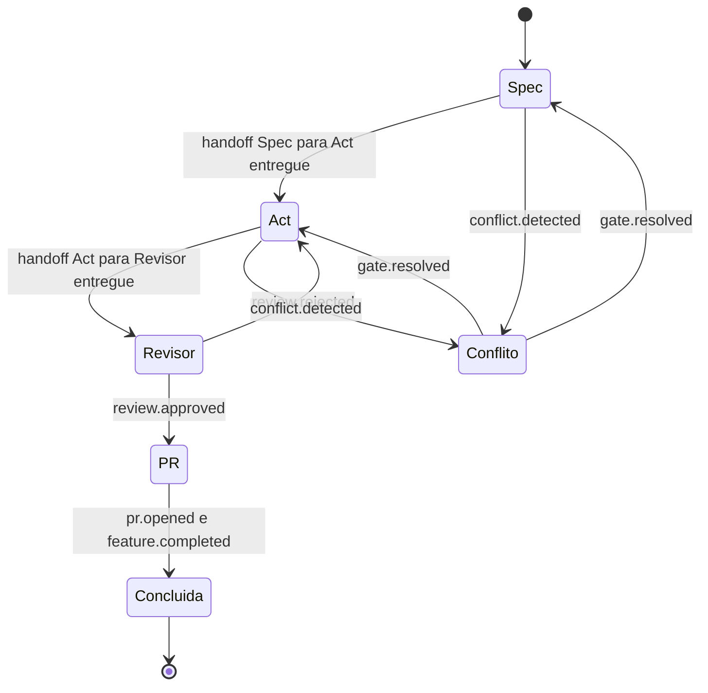
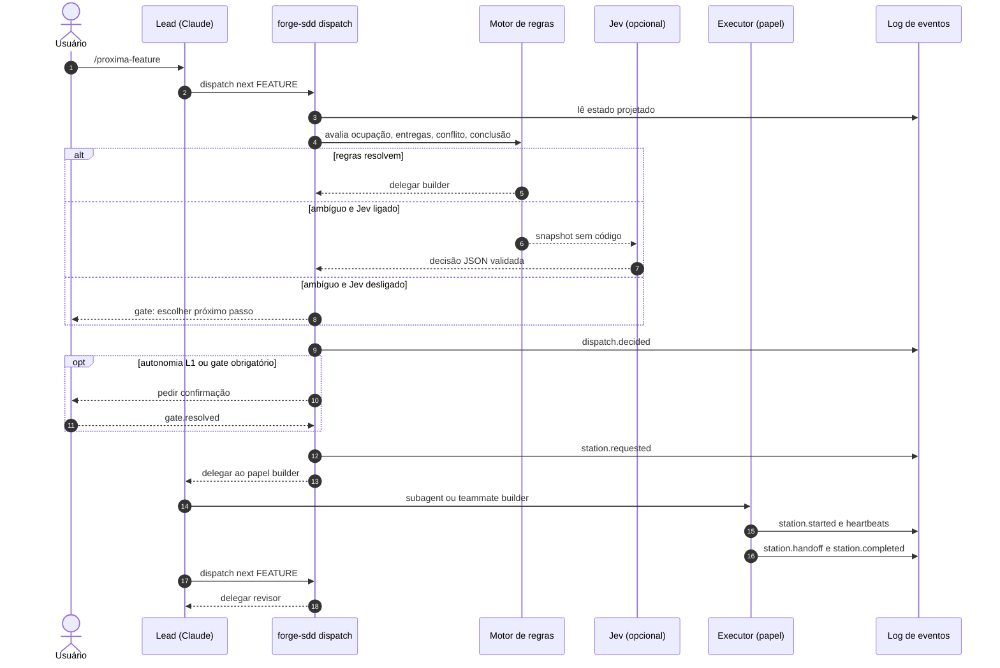

# Critérios Técnicos 56 — Papéis Especialistas, Agent Teams e Jev (opcional)

Visão de engenharia do `discovery-56`. Linguagem: padrão (Constituição, regra 0).

## 1. Restrições (Constituição)

| Regra | Impacto neste trabalho |
|---|---|
| 3 | Templates de prompt do Jev e schemas embutidos via `embed.FS`; nenhum arquivo externo em runtime |
| 4 | `OPENROUTER_API_KEY` só por variável de ambiente; nunca em `.sddrc`, binário ou repositório |
| 8 | Cliente OpenRouter com `net/http` da stdlib; sem SDK de terceiros |
| 14 | Toda decisão e sessão do Jev gera telemetria na fase Close, mesmo se cancelada/timeout |
| 15 | Todas as estações de uma feature usam a **mesma** branch; o Jev nunca cria branch por estação |
| 1/11 | Merge e release nunca são autônomos: sempre gate humano |
| 3 (papéis) | Papéis canônicos e adaptadores `.claude/agents/*` embutidos via `embed.FS` |
| 15 | Teammates e subagents da mesma feature trabalham na mesma branch; arquivos de escrita disjuntos entre teammates |

## 2. Arquitetura (C4 Model — Mermaid)

### Nível 1 — Contexto



### Nível 2 — Contêineres



### Fluxo de decisão (componente)



## 2.1 Papéis comuns e adaptadores (revisão 2)

**Fonte canônica:** `.agents/roles/<papel>.md` (gerado pelo scaffold; análogo a `.agents/commands/`). Adaptadores:

| Agente | Arquivo gerado | Conteúdo |
|---|---|---|
| Claude | `.claude/agents/<papel>.md` | frontmatter (`name`, `description`, `tools`, `model`) + ponteiro para o papel canônico |
| Gemini | `.gemini/skills/<papel>.chatmode.md` | ponteiro para o papel canônico (hoje: corpo duplicado) |
| Copilot | `.github/chatmodes/<papel>.chatmode.md` | ponteiro para o papel canônico (hoje: corpo duplicado) |

**Papéis e ferramentas no Claude** (`tools`; `model: inherit` por padrão, sobrescrevível por `.sddrc`):

| Papel | Escreve | `tools` | Observação |
|---|---|---|---|
| orquestrador | `progress.md`, telemetria | Read, Grep, Glob, Edit, Bash, Agent | é o **lead**; definição também gerada |
| specifier | specs em `sdd/` | Read, Grep, Glob, Edit, Write, Bash | escopo `sdd/` reforçado por hook |
| builder | código | Read, Grep, Glob, Edit, Write, Bash | |
| revisor | nada | Read, Grep, Glob, Bash | sem Edit/Write; `Bash` é barreira parcial |
| archivist | `progress.md`/`progress-log.md` | Read, Edit | |
| migrator | arquivos do scaffold | Read, Grep, Glob, Edit, Write, Bash | |
| c4-architecture | `sdd/spec/` | Read, Grep, Glob, Write | |

**Regras de geração:** `update` sobrescreve só os arquivos gerados pelo Forge e **preserva** agentes criados pelo usuário em `.claude/agents/`; `doctor` aponta papel ausente/divergente.

**Teams (opt-in):** `forge-sdd init --claude-teams` grava `CLAUDE_CODE_EXPERIMENTAL_AGENT_TEAMS=1` em `.claude/settings.json` (`env`), com aviso de custo, de recurso experimental, da indisponibilidade em `-p` e de que subagents nomeados passam a abrir como teammates. Sem a flag, nada é ligado. Nenhum arquivo em `.claude/teams/` é gerado (não é reconhecido).

**Hooks (opt-in com teams):** `TaskCompleted` → `forge-sdd run verify <feature>` (roda o critério executável; exit 2 bloqueia); `TeammateIdle` → checa handoff entregue no ledger.

## 2.2 Economia de tokens e especialistas (revisão 3)

**Jev opcional:** o despacho funciona só com o motor determinístico (`forge-sdd dispatch` sem chamada externa). O pacote do cliente OpenRouter não é importado por nenhum outro pacote do projeto.

**Modelo por papel** (`.sddrc`, bloco opcional; sem ele valem os padrões do frontmatter):
```json
"roles": { "builder": {"model": "sonnet"}, "archivist": {"model": "haiku"}, "revisor": {"model": "inherit"} }
```
Valores iniciais são hipótese; devem ser revistos com `forge-sdd report`.

**Especialistas:** `forge-sdd agents sync` lê `.agents/rules/*.md` (ignora `*.example`) e gera `.claude/agents/esp-<dominio>.md` (frontmatter com `name`, `description` curta derivada do título da regra, `tools` restritas, `model`; corpo apontando para a regra). Nunca grava em `.agents/rules/`. Especialista cuja regra sumiu é reportado como órfão, sem ser apagado.

**Relatório por papel:** `forge-sdd report --by-role` agrega `tokens_input`/`tokens_output`/`model`/duração a partir de `agent_path` nos `session-*.json`.

## 2.3 Arquitetura do `dispatch` orientada a eventos (revisão 4)

**Ideia central:** cada mudança de estado da esteira é um **evento** gravado num log append-only; o estado (ledger) é uma **projeção** do log; o **dispatch** é a função que, dado o estado, decide o próximo evento. Não há daemon: o `dispatch` roda sob demanda (comando ou hook), então segue a Regra 8 (stdlib, sem runtime extra) e não gasta token enquanto nada acontece.

### 2.3.1 Componentes



### 2.3.2 Catálogo de eventos

Todo evento: `id`, `ts`, `feature` (caminho completo, Regra 14), `station`, `role`, `agent`, `session_id`, `source` (`rules` | `jev` | `human` | `hook`), `payload`.

| Evento | Quem emite | Efeito na projeção |
|---|---|---|
| `feature.opened` | `/nova-feature`, `/split-features` | cria a esteira; estação `spec` = pending |
| `dispatch.decided` | `dispatch` | registra decisão (etapa, papel, ação, confiança, fonte) |
| `gate.requested` | `dispatch` | estação = waiting_human |
| `gate.resolved` | humano | libera ou cancela a estação |
| `station.requested` | `dispatch` | estação = requested; papel e agente escolhidos |
| `station.started` | executor | estação = running; lease e `session_id` |
| `station.heartbeat` | executor/hook | renova o lease |
| `station.handoff` | executor | handoff entregue (formato do discovery-53) |
| `station.completed` | executor/hook | estação = done com `outcome` |
| `station.failed` | executor | estação = blocked |
| `lease.expired` | `dispatch` | estação running sem heartbeat vira blocked |
| `conflict.detected` | `dispatch` | feature = conflicted; exige gate |
| `review.approved` / `review.rejected` | Revisor | aprova ou devolve ao Builder |
| `feature.completed` | `dispatch` | todas as tasks `[x]`, critério passando, revisão aprovada |
| `pr.opened` | Orquestrador | fim da esteira |

### 2.3.3 Máquina de estados da estação



### 2.3.4 Fluxo da feature (Spec, Act, Revisor)



### 2.3.5 Sequência: caminho feliz com Jev desligado e com Jev ligado



### 2.3.6 Princípios e invariantes
- **Projeção reconstruível:** apagar o ledger e refazê-lo a partir do log produz o mesmo estado (teste). O log é a fonte de verdade entre sessões; teams é efêmero.
- **Escrita segura:** `O_APPEND` com lock de arquivo; eventos idempotentes por `id`; evento inválido é rejeitado e registrado, nunca aplicado.
- **Quem decide e quem executa são separados:** `dispatch` nunca executa trabalho; o executor nunca decide a próxima estação.
- **Ordem de decisão fixa:** regras → (Jev, se ligado e necessário) → gates. O Jev nunca contorna um gate.
- **Mesmo log para os 3 agentes:** Claude emite por hook ou pelo lead; Gemini e Copilot emitem via `forge-sdd run emit` indicado no prompt do comando, o mesmo padrão já usado por `forge-sdd session record`.
- **Uma branch por feature (Regra 15):** todas as estações e teammates da feature usam a mesma branch; o evento `station.started` falha se a branch for diferente.

## 3. Contratos

**Entrada do Jev (snapshot, sem conteúdo de código):** `feature`, `stage`, estado das estações, leases/heartbeats, `files_touched` por feature ativa, tasks `[ ]/[x]`, `outcome` da última revisão, agentes habilitados.

**Saída obrigatória (JSON validado por schema embutido):**

```json
{
  "stage": "spec|act|revisor|pr|done",
  "action": "delegate|wait|escalate|done",
  "next_agent": "builder|revisor|specifier|human|none",
  "busy": false,
  "deliverables_complete": true,
  "conflicts": [{"with": "feat-XX", "files": ["..."], "severity": "low|high"}],
  "feature_complete": false,
  "confidence": 0.0,
  "reason": "string"
}
```

**Config em `sdd/.sddrc`:** `dispatcher: {enabled, provider: "openrouter", model, autonomy: "L0|L1|L2", min_confidence, timeout_seconds, lease_seconds}`. Padrão: `enabled=false`, `autonomy=L1`.

**Ledger (`sdd/.runs/<feature>.json`)** — fonte de verdade entre sessões, pois teams é efêmero e não retoma teammates: `branch`, `stations[{name, state, session_id, agent, heartbeat, handoff_ok}]`.

## 4. Integridade

- Resposta do Jev fora do schema = inválida → fallback determinístico/humano; **nunca** executar texto livre do modelo.
- O Jev só pode escolher entre agentes habilitados em `.sddrc`.
- Lease expirado marca a estação `blocked`; nunca assume que terminou.
- Snapshot passa por redação (sem secrets, sem código); chave nunca é logada.
- Retrocompatibilidade: com `dispatcher.enabled=false` (padrão) o comportamento atual não muda.

## 5. Critérios de Aceitação (executáveis)

1. `go build ./... && go vet ./...` passam (Regras 6 e 7).
2. `go test ./...` cobre: (a) estação com lease vigente é reportada `busy=true` sem chamar o Jev; (b) duas features com `files_touched` sobrepostos geram `conflicts` e ação `escalate`; (c) feature com todas as tasks `[x]`, critério passando e revisão `approved` resulta em `done`; (d) resposta inválida/timeout do Jev (servidor `httptest`) cai no fallback e **não** avança.
3. Teste de que `OPENROUTER_API_KEY` ausente desabilita o Jev com mensagem clara e não grava a chave em nenhum arquivo.
4. Teste de que o snapshot enviado ao `httptest` não contém conteúdo de arquivos nem valores de secrets.
5. Teste de que em `L2` merge/release/escopo ambíguo sempre retornam `escalate`.
6. Teste de Regra 15: delegar duas estações da mesma feature usa uma única branch.
7. Telemetria: toda decisão grava `session-*.json` com `feature` em caminho completo (Regra 14), inclusive em timeout.
8. Com `dispatcher.enabled=false`, a saída dos comandos atuais é idêntica (teste de regressão).

9. Scaffold para `claude` gera `.claude/agents/{orquestrador,specifier,builder,revisor,archivist,migrator,c4-architecture}.md` com frontmatter válido; o do `revisor` **não** lista `Edit`/`Write` (teste de golden file).
10. Teste de que os três adaptadores (Claude, Gemini, Copilot) apontam para o **mesmo** `.agents/roles/<papel>.md` e que não restou corpo duplicado nos chatmodes.
11. `update` preserva um agente de usuário em `.claude/agents/` e `doctor` reporta papel ausente.
12. `init` sem `--claude-teams` não escreve a variável experimental; com a flag, escreve em `.claude/settings.json` e **não** cria `.claude/teams/`.
13. Teste de que `forge-sdd run verify` retorna exit 2 quando o critério executável falha e 0 quando passa (base do hook `TaskCompleted`).
14. Com a telemetria ligada, uma execução com N teammates gera N `session-*.json` com o mesmo `feature` (Regra 14).

15. Sem `OPENROUTER_API_KEY` e com `dispatcher.enabled=false`, `forge-sdd dispatch` responde etapa/papel/ocupação/conflito/conclusão **sem nenhuma requisição de rede** (teste com cliente HTTP que falha se chamado).
16. Teste de arquitetura: nenhum pacote fora de `internal/jev` (nome ilustrativo) importa o cliente OpenRouter.
17. Cada papel gerado tem `model` definido; `roles.<papel>.model` no `.sddrc` sobrescreve o padrão (golden file).
18. `forge-sdd agents sync` gera um especialista por arquivo `.md` de `.agents/rules/`, não gera para `.example`, e o diff de `.agents/rules/` após o comando é vazio.
19. Regra removida → especialista marcado órfão e mantido; `doctor` avisa especialistas em excesso ou com `description` duplicada.
20. `forge-sdd report --by-role` soma tokens por papel de forma consistente com o total por feature.

21. Reconstruir o ledger a partir de `events.jsonl` produz estado idêntico ao ledger anterior (teste de projeção determinística).
22. Dois `run emit` concorrentes na mesma feature não corrompem o log nem duplicam eventos com o mesmo `id` (teste com goroutines).
23. Transições inválidas (ex.: `station.completed` sem `station.started`) são rejeitadas e geram evento de erro, sem alterar o estado.
24. `station.heartbeat` ausente além de `lease_seconds` faz o `dispatch` emitir `lease.expired` e marcar a estação `blocked`.
25. `dispatch` nunca emite `station.requested` enquanto houver `gate.requested` sem `gate.resolved`, nem com o Jev decidindo.
26. `station.started` em branch diferente da branch da feature é rejeitado (Regra 15).

## 6. Dependências

- Spike `feat-5ae2-06` (recomendou piloto só no Claude) e decisão do usuário sobre assimetria: esta revisão **resolve** o risco ao manter uma definição única de papel para os três agentes; só o isolamento (subagent/teammate) é específico do Claude.
- Versão do Claude Code com agent teams habilitável (recurso experimental; validar `claude --version` no `doctor`).
- Handoff estruturado Act → Revisor e telemetria correlacionada por `feature` (discovery-53, Tarefas 1-3).
- Decisão de produto sobre assimetria entre agentes (discovery-53, Tarefa 4).
- Confirmação do modelo/ID do Jev no OpenRouter e de condições de privacidade/custo antes de qualquer piloto real.
