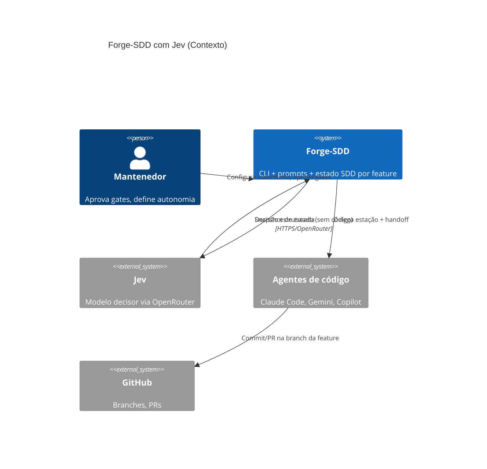
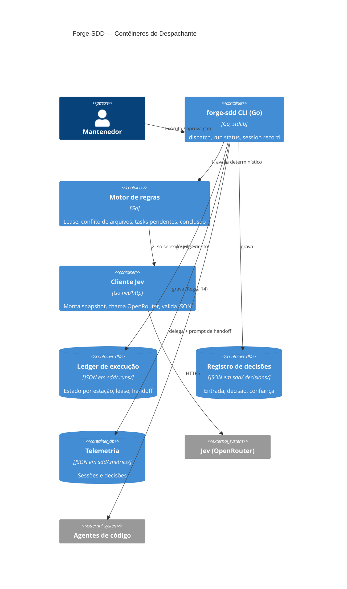
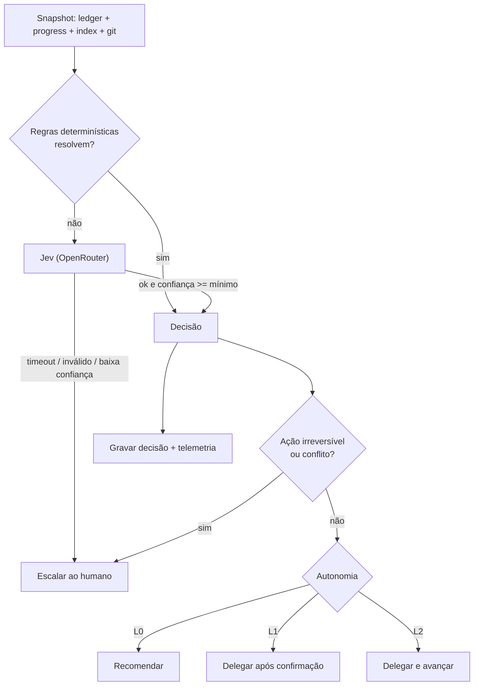

# Critérios Técnicos 56 — Jev como Despachante/Decisor e Operação por Sessão

Visão de engenharia do `discovery-56`. Linguagem: padrão (Constituição, regra 0).

## 1. Restrições (Constituição)

| Regra | Impacto neste trabalho |
|---|---|
| 3 | Templates de prompt do Jev e schemas embutidos via `embed.FS`; nenhum arquivo externo em runtime |
| 4 | `OPENROUTER_API_KEY` só por variável de ambiente; nunca em `.sddrc`, binário ou repositório |
| 8 | Cliente OpenRouter com `net/http` da stdlib; sem SDK de terceiros |
| 14 | Toda decisão e sessão do Jev gera telemetria na fase Close, mesmo se cancelada/timeout |
| 15 | Todas as estações de uma feature usam a **mesma** branch; o Jev nunca cria branch por estação |
| 1/11 | Merge e release nunca são autônomos: sempre gate humano |

## 2. Arquitetura (C4 Model — Mermaid)

### Nível 1 — Contexto



### Nível 2 — Contêineres



### Fluxo de decisão (componente)



## 3. Contratos

**Entrada do Jev (snapshot, sem conteúdo de código):** `feature`, `stage`, estado das estações, leases/heartbeats, `files_touched` por feature ativa, tasks `[ ]/[x]`, `outcome` da última revisão, agentes habilitados.

**Saída obrigatória (JSON validado por schema embutido):**

```json
{
  "stage": "spec|act|revisor|pr|done",
  "action": "delegate|wait|escalate|done",
  "next_agent": "builder|revisor|specifier|human|none",
  "busy": false,
  "deliverables_complete": true,
  "conflicts": [{"with": "feat-XX", "files": ["..."], "severity": "low|high"}],
  "feature_complete": false,
  "confidence": 0.0,
  "reason": "string"
}
```

**Config em `sdd/.sddrc`:** `dispatcher: {enabled, provider: "openrouter", model, autonomy: "L0|L1|L2", min_confidence, timeout_seconds, lease_seconds}`. Padrão: `enabled=false`, `autonomy=L1`.

**Ledger (`sdd/.runs/<feature>.json`):** `branch`, `stations[{name, state, session_id, agent, heartbeat, handoff_ok}]`.

## 4. Integridade

- Resposta do Jev fora do schema = inválida → fallback determinístico/humano; **nunca** executar texto livre do modelo.
- O Jev só pode escolher entre agentes habilitados em `.sddrc`.
- Lease expirado marca a estação `blocked`; nunca assume que terminou.
- Snapshot passa por redação (sem secrets, sem código); chave nunca é logada.
- Retrocompatibilidade: com `dispatcher.enabled=false` (padrão) o comportamento atual não muda.

## 5. Critérios de Aceitação (executáveis)

1. `go build ./... && go vet ./...` passam (Regras 6 e 7).
2. `go test ./...` cobre: (a) estação com lease vigente é reportada `busy=true` sem chamar o Jev; (b) duas features com `files_touched` sobrepostos geram `conflicts` e ação `escalate`; (c) feature com todas as tasks `[x]`, critério passando e revisão `approved` resulta em `done`; (d) resposta inválida/timeout do Jev (servidor `httptest`) cai no fallback e **não** avança.
3. Teste de que `OPENROUTER_API_KEY` ausente desabilita o Jev com mensagem clara e não grava a chave em nenhum arquivo.
4. Teste de que o snapshot enviado ao `httptest` não contém conteúdo de arquivos nem valores de secrets.
5. Teste de que em `L2` merge/release/escopo ambíguo sempre retornam `escalate`.
6. Teste de Regra 15: delegar duas estações da mesma feature usa uma única branch.
7. Telemetria: toda decisão grava `session-*.json` com `feature` em caminho completo (Regra 14), inclusive em timeout.
8. Com `dispatcher.enabled=false`, a saída dos comandos atuais é idêntica (teste de regressão).

## 6. Dependências

- Handoff estruturado Act → Revisor e telemetria correlacionada por `feature` (discovery-53, Tarefas 1-3).
- Decisão de produto sobre assimetria entre agentes (discovery-53, Tarefa 4).
- Confirmação do modelo/ID do Jev no OpenRouter e de condições de privacidade/custo antes de qualquer piloto real.
