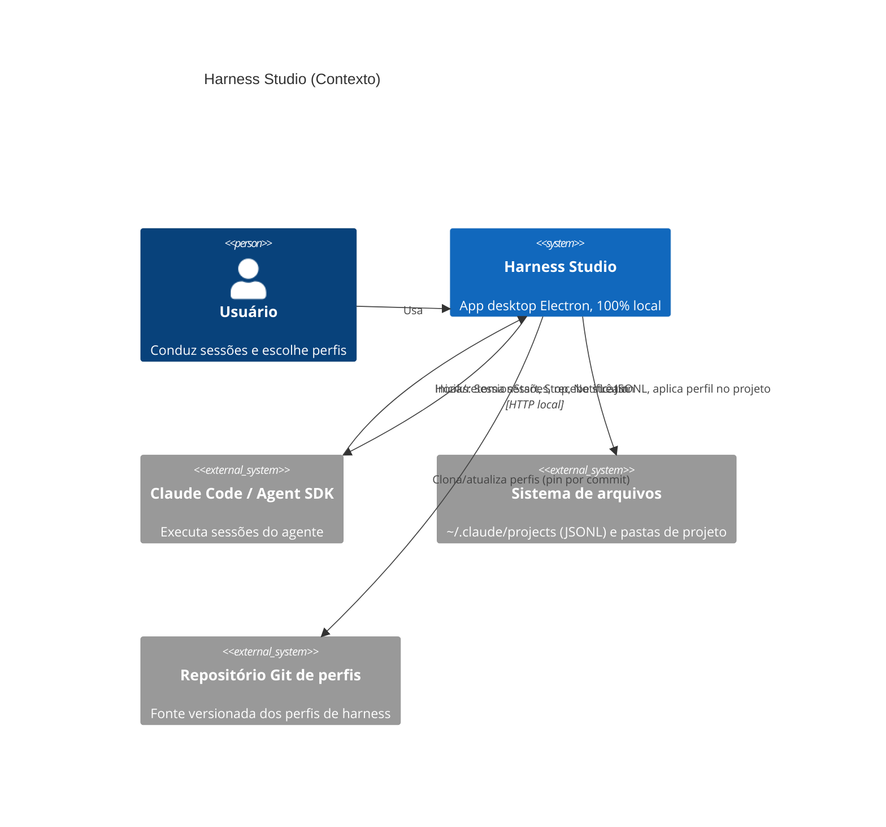
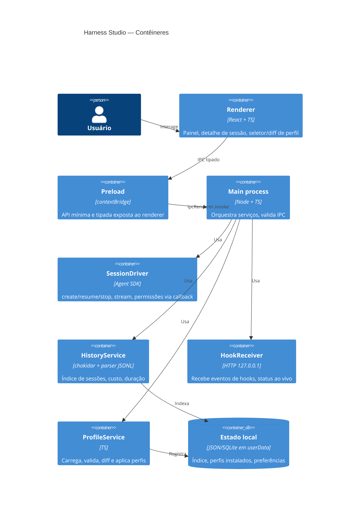

# Critérios Técnicos 57 — Harness Studio (Electron + Agent SDK)

Visão de engenharia do `discovery-57`. As regras da Constituição do Forge SDD (Go, `embed.FS`) **não se aplicam ao repo novo**; valem como inspiração (não sobrescrever arquivos sem aviso, chaves só por ambiente, tudo local).

## 1. Restrições

| Tema | Restrição |
|---|---|
| Stack | Electron + React + TypeScript; Node no main process; build com Vite (renderer) |
| Segurança Electron | `contextIsolation: true`, `nodeIntegration: false`, `sandbox: true` no renderer, CSP estrita, IPC tipado e validado (schema) no main |
| Privacidade | 100% local; sem telemetria externa; JSONL nunca sai da máquina nem é copiado para fora de `userData` |
| Leitura de JSONL | Somente leitura; parser tolerante a campos desconhecidos; fixtures versionadas por versão do Claude Code |
| Credenciais | Autenticação herdada do Claude Code do usuário; o app nunca persiste chaves |
| Perfis | Pinados por commit/hash; revisão obrigatória de hooks/MCP/comandos antes de aplicar; nunca sobrescrever sem diff e confirmação |
| Plataformas | macOS e Windows (Linux best-effort) |

## 2. Arquitetura (C4 Model — Mermaid)

### Nível 1 — Contexto

### Nível 2 — Contêineres

## 3. Contratos

- **Perfil de harness (MVP):** pasta com `profile.json` (`name`, `version`, `description`, `files[]` com destino relativo, `hooks[]` e `mcpServers[]` declarados para revisão, `source` com commit/hash) + arquivos a copiar. Pós-MVP: mapeável para o formato plugin do Claude Code.
- **IPC:** canais nomeados (`sessions:list`, `sessions:start`, `sessions:resume`, `sessions:stop`, `profiles:preview`, `profiles:apply`); payloads validados com schema no main; eventos do main para o renderer por canais de assinatura.
- **Hook → app:** `POST http://127.0.0.1:<porta>/hook` com token efêmero por sessão (gerado pelo app e injetado no `settings.json` do projeto); corpo JSON do evento; rejeitar sem token.

## 4. Critérios de aceitação (executáveis)

1. **HistoryService:** dado um conjunto de fixtures JSONL, lista N sessões com custo/duração corretos; arquivo corrompido ou campo novo não derruba o índice (teste unitário).
2. **Tempo real:** anexar linhas a um JSONL atualiza a sessão no painel em ≤ 2 s (teste de integração com `chokidar`).
3. **SessionDriver:** com o SDK mockado, `start`/`resume`/`stop` emitem o stream esperado e o callback de permissão bloqueia a tool até a resposta do usuário.
4. **ProfileService:** `preview` lista arquivos novos/alterados/conflitantes sem escrever nada; `apply` só grava após confirmação e nunca sobrescreve sem ela; hooks e MCP do perfil aparecem na revisão.
5. **HookReceiver:** escuta só em `127.0.0.1`; requisição sem token recebe 401; evento válido altera o status em ≤ 1 s.
6. **Segurança:** teste automatizado confirma `nodeIntegration=false`, `contextIsolation=true`, `sandbox=true` e ausência de `require` no renderer; nenhuma conexão de saída além do que o Claude Code já faz.
7. **E2E (Playwright + Electron):** fluxo "escolher perfil → confirmar diff → iniciar sessão → ver status → encerrar" passa em macOS e Windows.

## 5. Riscos técnicos e mitigação

| Risco | Mitigação |
|---|---|
| Mudança do formato JSONL | Parser tolerante, fixtures por versão, somente leitura, falha isolada por arquivo |
| Mudança de API do SDK | `SessionDriver` como único ponto de acoplamento + fallback CLI `stream-json` |
| Perfil malicioso | Pin de hash, revisão obrigatória, listagem explícita de hooks/MCP/comandos, sem execução durante preview |
| Porta local exposta | Bind em 127.0.0.1, porta aleatória, token efêmero |
| Conflito com `.claude/` existente | Diff + backup antes de aplicar; opção de desfazer |
