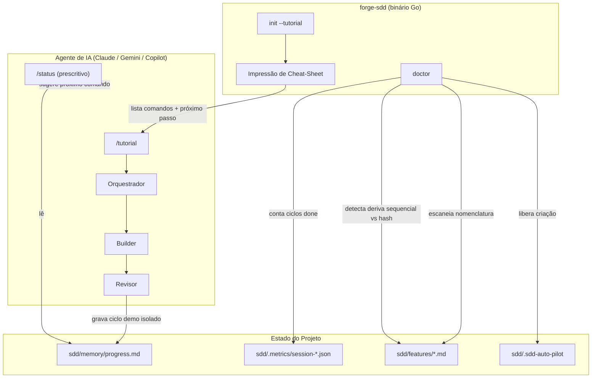

# Critérios Técnicos 5ae2 — Reduzindo a Curva de Aprendizado do Forge-SDD

Este documento define os critérios de aceitação técnicos, restrições e o diagrama C4 da solução para as evoluções propostas em `discovery-5ae2`.

## 1. Critérios de Aceitação Técnicos

1. **Comando de Onboarding Guiado:**
   * Deve existir um prompt `/tutorial` (replicado nos três agentes, seguindo o padrão de `internal/scaffold/templates/agents/*/`) que gera um discovery, uma feature e um ciclo `PLAN → ACT → CLOSE` completos usando dados fictícios, sem afetar `sdd/features/index.md` real (grava em subpasta isolada, ex: `sdd/features/_tutorial/`).
   * O CLI (`forge-sdd init`) deve aceitar uma flag `--tutorial` que já deixa o flag/sinalizador necessário para o prompt saber que deve rodar em modo demonstrativo.

2. **`/status` Prescritivo:**
   * O prompt `/status` deve, além do estado atual, emitir sempre uma linha final `Próximo comando sugerido: <comando>` calculada a partir do estado de `sdd/memory/progress.md` (ex: nenhuma feature `todo` e discovery vazio → sugerir `/discovery`; features `todo` existentes → sugerir `/proxima-feature`).

3. **Cheat-sheet no CLI:**
   * Ao final de `forge-sdd init` (build bem-sucedida, não em `--dry-run`), o binário deve imprimir no terminal a lista ordenada dos 11 comandos SDD com uma linha de descrição cada, extraída de metadado (front-matter ou primeira linha) dos próprios arquivos `.prompt.md.tmpl`, para não duplicar a fonte da verdade.

4. **Detecção de Deriva de Convenção (`doctor`):**
   * `forge-sdd doctor` deve escanear `sdd/features/*.md` e `sdd/discovery/*.md` e classificar os nomes encontrados como convenção `sequencial` (`feat-NN`) ou `hash` (`feat-[0-9a-f]{4}`).
   * Se ambas as convenções coexistirem no mesmo projeto, `doctor` deve reportar um aviso explícito de inconsistência, citando os arquivos conflitantes.

5. **Gate de Graduação para Autopilot:**
   * A criação do arquivo `sdd/.sdd-auto-pilot` via CLI/skill deve ser bloqueada por padrão até que existam **N ciclos completos** (`outcome: done`, configurável, default 3) registrados em `sdd/.metrics/session-*.json`.
   * Deve existir uma flag explícita de bypass consciente (ex: `--skip-graduation`) documentada como "eu sei o que estou fazendo".

6. **Subagentes Nativos (Prova de Conceito):**
   * Deve existir uma investigação técnica documentada (spike, não obrigatoriamente shippado nesta rodada) sobre viabilidade de expressar Orquestrador/Builder/Revisor como definições de subagente nativo (ex: `.claude/agents/orquestrador.md`, `.claude/agents/builder.md`, `.claude/agents/revisor.md`) por agente suportado, mapeando quais dos três (Claude, Gemini, Copilot) já suportam esse primitivo nativamente hoje.
   * Critério de saída do spike: uma tabela de suporte por agente + recomendação de ir/não ir adiante, registrada como task dentro da feature correspondente.

## 2. Diagrama C4 — Fluxo de Onboarding Guiado e Auditoria de Convenção (Mermaid)

## 3. Restrições

- Nenhuma mudança pode quebrar o contrato atual dos comandos públicos do CLI (`init`, `doctor`, `destroy`, `update` — Regra 10 da Constituição).
- Templates continuam embutidos via `embed.FS` (Regra 3) — o cheat-sheet deve ser gerado a partir dos templates já embutidos, sem novo asset externo.
- `go vet ./...` e `go build` devem passar após cada task (Regras 6-7).
