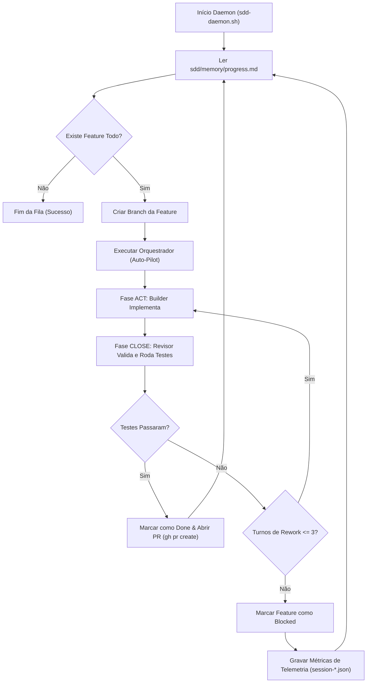

# Critérios Técnicos 9b2f — Autonomia e Construção Contínua (Hardness Engineer)

Este documento define os critérios de aceitação técnicos, regras de arquitetura e o diagrama da solução para loops autônomos de desenvolvimento local.

## 1. Critérios de Aceitação Técnicos

1. **Bypass de Confirmação (Flag de Piloto Automático):**
   * O Orquestrador deve verificar a existência do arquivo `sdd/.sdd-auto-pilot` na raiz do projeto.
   * Se o arquivo estiver presente, o Orquestrador **deve** pular o passo de aguardar a confirmação humana no final da fase PLAN e iniciar imediatamente a fase ACT (delegando para o Builder local).
2. **Daemon de Controle de Execução (CLI Loop):**
   * Deve ser possível iniciar o loop de execução contínua com um script local (ex: `scripts/sdd-daemon.sh`).
   * O script deve executar ciclicamente as chamadas de agente até que o status de todas as features em `sdd/memory/progress.md` mude de `todo` para `done`.
3. **Persistência de Telemetria e Erros:**
   * Caso o Builder ou o Revisor encontrem um erro insolúvel (ex: erro de compilação ou falha de testes persistente em 3 turnos), o Orquestrador deve marcar a feature como `blocked` no `progress.md`, gravar a métrica com `outcome: blocked` e prosseguir para a próxima feature ou encerrar o daemon com código de saída de erro.

## 2. Diagrama de Fluxo de Execução Autônoma (Mermaid)

